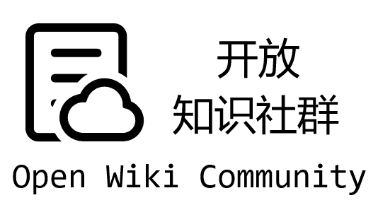

    

 

开放知识社群是一个围绕计算机与人工智能的体系化学习笔记知识库。

# 开放知识社群

开放知识社群围绕计算机和人工智能，体系化地记录了相关的学习笔记。

笔记按照 Markdown 格式撰写，站点采用 MkDocs 框架编译，云端基于 Aliyun OSS 服务部署。在线浏览地址：<https://wiki.dwj601.cn>。您的⭐与反馈是我们更新的最大动力！

## 共建社区

若您有 **意见或建议**，欢迎参与贡献！贡献者名单将会出现在对应页面的底部，也会给您的 GitHub 账户累计贡献积分。详细的贡献方式：

1. 点击网站右上角的小猫娘前往 GitHub 仓库；
2. 点击右上角 Fork 按钮；
3. 回到原来的网站页面点击右上角铅笔按钮；
4. 编辑内容后向我发起 Pull Request。

当然您也可以将仓库克隆至本地，安装好 `requirements.txt` 中的 Python 依赖包后进行热编辑，即 `mkdocs serve -f local.yml`。完成修改/新增后，推送至仓库并向我发起 Pull Request。

本站点行文格式主要参考 [OI Wiki 格式手册](https://oi-wiki.org/intro/format/)。其中：

- 标题：单页文章标题为 H2 至 H3，低于 H3 等级的标题不应再出现，可以采用段首加粗的形式；
- 链接：所有内链请采用相对引用的格式，例如 `[基础知识](./base/index.md)`。

## 贡献名单

## 星标历史

