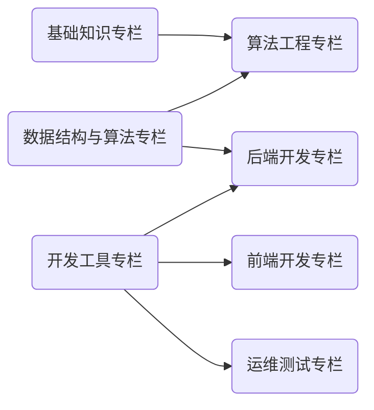

    

本网站以 **体系化** 的学习笔记为基础，旨在围绕「计算机与人工智能」构建一个 **开放知识社群**。

在线浏览地址：<https://wiki.dwj601.cn/>。您的⭐与反馈是我们更新的最大动力！

## 关于本站

笔记按照 Markdown 格式记录，站点采用 MkDocs 框架编译，云端基于 Aliyun OSS 服务部署。下图展示了本站的所有专栏：

## 共建社区

若您有 **意见或建议**，欢迎参与贡献！贡献者名单将会出现在对应页面的底部，也会给您的 GitHub 账户累计贡献积分。详细的贡献方式：

1. 点击网站右上角的小猫娘前往 GitHub 仓库；
2. 点击右上角 Fork 按钮；
3. 回到原来的网站页面点击右上角铅笔按钮；
4. 编辑内容后向我发起 Pull Request。

当然您也可以将仓库克隆至本地，按照 `.github/workflows/bot.yml` 文件指引安装构建文档所需的依赖环境，完成修改/新增后，推送至仓库并向我发起 Pull Request。

本站点行文格式主要参考 [OI Wiki 格式手册](https://oi-wiki.org/intro/format/)。其中：

- 标题：单页文章标题为 H2 至 H3，低于 H3 等级的标题不应再出现，可以采用段首加粗的形式；
- 链接：所有内链请采用相对引用的格式。

## 贡献名单

## 星标历史

