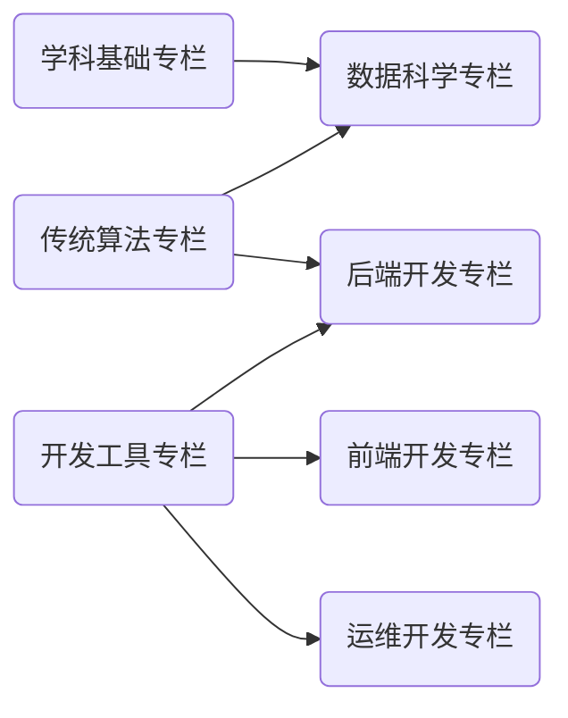

    

本网站以体系化的 AI/CS 学习笔记为基础，旨在构建一个 **开放知识社群 (Open Wiki Community)**。如果您觉得内容不错，欢迎⭐！

笔记按照 Markdown 格式记录，站点采用 MkDocs 框架编译，云端基于 Aliyun OSS 服务部署。访问链接：<https://wiki.dwj601.cn/>。

## 站点预览 / Site Preview

<caption> 站点内容拓扑图 </caption>

## 贡献名单 / Contributors

## 星标历史 / Star History

