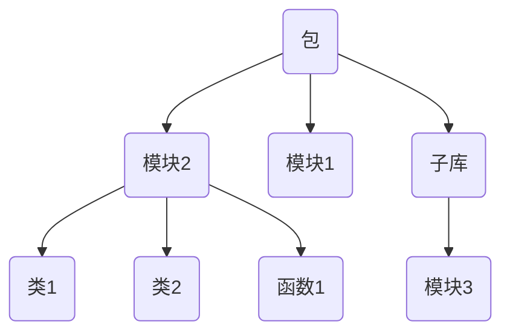

本文记录 Python 的基本概念。

## 解释器

Python 是一门解释型语言，代码不会被提前编译成机器码，而是由解释器在运行时逐行转换并执行。解释器会先将 `.py` 代码转换为 `.pyc` 字节码，然后逐行执行字节码得到运行结果。根据场景的不同，执行字节码的实现也不同，目前主流的有以下几种实现：

| 实现    | 开发语言 | 字节码执行方式                                    | 特点                                  | 典型应用场景                        |
| ------- | -------- | ---------------------------------------------- | ----------------------------------------- | ----------------------------------- |
| CPython | C        | 逐条解释  | 官方标准实现，生态最全，速度中等      | 默认实现、科研计算、Web 后端等     |
| PyPy    | Python | 逐条解释，但会在运行时将热点字节码即时 (Just In Time, JIT) 编译为机器码，直接在 CPU 上执行 | 执行速度快，适合长时间运行的计算任务；但兼容性稍差 | 高性能计算、高并发等                 |
| Jython  | Java     | 将 Python 源码直接编译成 Java 字节码，然后由 JVM（Java 虚拟机）执行 | 能与 Java 无缝集成；但性能依赖 JVM 优化，启动速度稍慢 | 需要在 Java 环境中使用 Python 脚本 |

### 安装

直接去 [Python 官网](https://www.python.org/) 下载对应硬件架构的安装包即可。注意本地安装完之后不要把安装包删了，因为安装好的 Python 需要通过这个安装包进行后续的管理。

如果此前没有使用安装包卸载 Python，重新安装时就会出现各种异常报错，例如：`0x80070422` 和 `0x80070643` 报错。此时需要到注册表里彻底删掉对应的文件，在下面的三个路径下一一尝试，删除对应的版本的 Python 文件即可：

- `HKEY_LOCAL_MACHINE\SOFTWARE\Microsoft\Windows\CurrentVersion\Uninstall`
- `HKEY_LOCAL_MACHINE\SOFTWARE\WOW6432Node\Microsoft\Windows\CurrentVersion\Uninstall`
- `HKEY_CURRENT_USER\SOFTWARE\Microsoft\Windows\CurrentVersion\Uninstall`

### 集成开发环境

主流的主要有 [Pycharm](https://www.jetbrains.com/pycharm/)、[VSCode](https://code.visualstudio.com/) 等。

## 包

与 C++ 的命名空间类似，Python 以包（也称库）的形式组织不同的功能模块，每一个 `.py` 文件就是一个模块，模块中含有对应的类和函数。基本结构如下图所示：



得益于 Python 便捷的开发逻辑，其第三方包相当丰富。包分发系统 (Python Package Index, PyPI) 可以非常便捷地分发和管理第三方包。

### 包的隔离 (venv)

不同的项目往往依赖不同的包，为了避免出现包的版本冲突，一般推荐按照项目进行包的隔离，即虚拟环境。

Pycharm 和 VScode 等都提供了可视化的虚拟环境创建方法，但为了彻底理解虚拟环境的工作原理，这里仅讨论最朴素的创建方法，即使用 Python 配套安装的 venv 模块自定义创建虚拟环境。

主要有以下几个步骤：

- 创建虚拟环境目录：

    ```bash
    python -m venv <VenvFolderName>
    ```

- 激活虚拟环境的解释器：

    ```bash
    source <VenvFolderName>/Scripts/activate
    ```

- 失活虚拟环境的解释器：

    ```bash
    deactivate
    ```

由上可以看出，所谓虚拟环境，本质上就是拷贝（或链接）一个 Python 解释器，然后将各种包安装在指定目录下，从而起到了隔离的效果。注意虚拟环境并不代表根解释器的完全拷贝，有些项目无关的文件并不会拷贝，所以不能删除根解释器。

### 包的管理 (pip)

pip 是安装 Python 时自带的程序，用来管理项目中的第三方库。

**更换 pip 的下载源**。默认的 pip 会从国外的 PyPI 拉取库，可能会遇到网络问题，我们可以更换 pip 的下载源。大致罗列几个比较出名的镜像源：

- 清华大学：`https://pypi.tuna.tsinghua.edu.cn/simple/`
- 中国科技大学：`https://pypi.mirrors.ustc.edu.cn/simple/`
- 阿里云：`https://mirrors.aliyun.com/pypi/simple/`
- 腾讯云：`https://mirrors.cloud.tencent.com/pypi/simple/`

更换 pip 下载源的方法有以下两种：

- 临时换源（适用于单次下载）：

    ```bash
    pip install <PackageName> -i <pip_source>
    ```

- 永久换源（适用于项目级管理）：

    ```bash
    pip config set global.index-url <pip_source>
    ```

查看当前环境的 pip 下载源：

- 查看当前配置：

    ```bash
    pip config list
    ```

- 恢复默认源：

    ```bash
    pip config unset global.index-url
    ```

**管理项目中的所有包**。一个项目往往会依赖很多第三方包，如果需要协同开发，或者便于复现，就需要固定项目的环境，其中最重要的就是项目中依赖的各种包及其版本了。为此大家就规定需要将项目依赖的第三方包及其版本都记录下来。

例如下面的内容就指定了当前项目依赖的各种第三方库的名称及其版本：

```text
babel==2.17.0
charset-normalizer==3.4.1
click==8.1.8
gitdb==4.0.12
GitPython==3.1.44
```

目前主要有以下几种方法管理项目中的包列表：

- 【更推荐】如果当前环境仅为当前项目独有，使用下面的命令即可：

    ```bash
    pip freeze > requirements.txt
    ```

    上述命令会利用 pip 工具，将当前解释器的所有第三方库及其版本全部写到项目根目录下的 `requirements.txt` 文件中。

- 【不推荐】如果当前环境并非独属于当前项目，使用上述命令会生成很多与当前项目无关的依赖包。此时可以使用 [`pipreqs`](https://github.com/bndr/pipreqs) 工具，该工具可以自动搜索独属于当前项目依赖的包，命令如下：

    ```bash
    # 安装工具
    pip install pipreqs
    
    # 生成依赖文件
    pipreqs ./ --encoding=utf8 --force
    ```

有了项目依赖的第三方包列表后，其他人想要复刻环境，只需用以下命令一次性下载即可：

```bash
pip install -r requirements.txt
```

## 导入机制

在 Python 中，模块化开发的核心思想是将代码拆分为多个模块 `module` 和包 `package`，通过导入机制复用和组织代码，因此了解导入机制非常重要。

以下面的项目结构为例：

```bash
my_project/
│
├── main.py          # 主程序
├── utils.py         # 模块
└── pkg/             # 包
    ├── __init__.py  # 包初始化模块，从 Python 3.3 开始不强制写了
    ├── math_utils.py
    └── string_utils.py
```

### 模块的搜索顺序

当用 `import xxx` 尝试导入某一个模块时，Python 会按以下顺序搜索模块：

1. 当前执行脚本所在目录。例如执行 `python main.py`，解释器会先在 `main.py` 所在目录 `my_project` 中找；
2. 环境变量 `PYTHONPATH` 指定的路径。我们可以通过 `export PYTHONPATH=/path/to/mylibs` 指令进行指定；
3. 标准包路径。解释器自带的包，如 `os`、`sys` 等；
4. 第三方包路径。通过 `pip install` 安装的库都在这里，即 site-packages 目录。

可以用以下方式查看解释器的搜索路径：

```python
import sys
print("\n".join(sys.path))
```

输出：

```text
D:\desktop\my_project
D:\software\Python313\python313.zip
D:\software\Python313\DLLs
D:\software\Python313\Lib
D:\software\Python313
D:\software\Python313\Lib\site-packages
```

可以看到解释器的确按照上述顺序搜索模块。

### 模块的导入方式

分绝对导入和相对导入两种。

**绝对导入**。从项目根目录开始写路径，可以保证路径清晰，适合跨包引用。例如：

```python
# main.py
from pkg import math_utils
from pkg.string_utils import clean_text
```

**相对导入**。基于当前模块所在位置，使用 `.` 或 `..` 来表示相对路径，便于包的内部维护。例如：

```python
# 在 pkg/math_utils.py 内
from .. import utils             # 导入上一级目录的模块
from . import string_utils       # 导入同级模块
from .string_utils import cos    # 导入同级模块的函数
```

### 关于 `__name__`

在 Python 的导入与运行机制中，`__name__` 变量起着关键作用，它决定了当前模块在解释器眼中的身份。而决定 `__name__` 变量取值的，在于模块的运行方式。

**直接运行模块**。例如，使用 `python path/to/my_project/pkg/math_utils.py` 运行模块 `math_utils.py` 时：

- 模块身份。此时 `math_utils.py` 的 `__name__ = '__main__'`，解释器认为它是“顶层脚本”，而不是 `pkg` 包中的子模块；

- 搜索路径。Python 会将当前文件所在目录作为根目录，即 `sys.path[0] = path/to/my_project/pkg`。在解释器眼中，`pkg` 不是一个包，而只是一个普通目录；

- 运行结果：

    - 如果使用「绝对导入」，只能导入 `pkg` 目录下的模块；若试图导入外层模块，会报错：

        ```text
        ModuleNotFoundError
        ```

    - 如果使用「相对导入」，会报错：

        ```text
        ImportError: attempted relative import with no known parent package
        ```

        因为 Python 此时并不知道 `math_utils.py` 有“父包”，它被当成独立文件执行。

**通过 `-m` 参数运行模块**。例如，使用 `python -m pkg.math_utils` 运行模块 `math_utils.py` 时：

- 模块身份。此时 `math_utils.py` 的 `__name__ = '__main__'`，但仍属于 `pkg` 包的子模块；
- 搜索路径。Python 会将执行命令的当前目录作为根目录，即 `sys.path[0] = path/to/my_project`。解释器能正确识别 `pkg` 是顶层包；
- 运行结果。绝对导入、相对导入都能正常工作。

**`if __name__ == '__main__'` 的应用场景**。在实际开发中，包内子模块往往既要被其他模块导入，又希望能够单独测试。此时我们通常会在模块末尾写：

```python
if __name__ == '__main__':
    # 测试代码
    obj = SomeClass()
    obj.run()
```

这样当模块被 `import` 时，测试代码不会执行；当使用 `python -m pkg.math_utils` 运行时，测试代码才会执行，从而实现子模块的“就地单测”。

**总结一下**。直接运行文件时，解释器眼里它是孤立的脚本；用 `-m` 运行时，它才是包的一部分：

- 导入规则：顶层模块「必须」使用绝对导入；包内模块之间「最好」使用相对导入；
- 运行规则：顶层脚本「可以」直接 `python xxx.py` 运行；使用相对导入的包内子模块「必须」增加 `-m` 参数运行。

## 变量与作用域

理解作用域是理解一门编程语言的开始，这里就以变量为载体，结合与 C++ 的对比进行讲解。

### 变量引用

在 C++ 和 Python 中，赋值语句的语义是完全不同的。类比：C++ 变量像「盒子」，赋值就是再拿一个盒子装一份拷贝；而 Python 变量像「标签」，赋值就是多贴几个标签在同一个盒子上。下图生动的展示了 Python 变量的意义：


**C++：赋值会产生拷贝（盒子模型）**。给变量赋值时，会重新申请内存空间，把数据复制过去。

例如下面的程序。输出的内存地址不同，说明 `a` 和 `b` 是两份独立的数据。：

```cpp
#include <iostream>
#include <vector>

int main() {
    std::vector<int> a = {1, 2, 3};
    std::vector<int> b = a;

    std::cout << &a << std::endl;  // 0x8b5a3ffa40
    std::cout << &b << std::endl;  // 0x8b5a3ffa20
    return 0;
}
```

**Python：赋值仅仅是增加引用（标签模型）**。所有变量其实都是「标签」，指向同一块数据。

例如下面的程序。三个变量的内存地址完全一样，说明它们指向同一份数据：

```python
a = [1, 2, 3]
b = a
c = a
print(id(a))  # 1542586187072
print(id(b))  # 1542586187072
print(id(c))  # 1542586187072
```

### 可变与不可变类型

理解引用后，关键在于弄清修改变量时会发生什么，而这与 Python 的数据类型息息相关。Python 的数据类型分「可变」和「不可变」两类。

**可变类型（列表 `list`、字典 `dict`、集合 `set`）**。修改操作为原地修改，不会新开内存，因此所有引用同时生效。

例如下面的程序。修改了其中一个变量的值以后，三个可变数据类型变量 $a,b,c$ 指向的内存空间没有发生改变，同时其余所有变量也都跟着改变：

```python
a = [1, 2, 3]
b = a
c = b
print(id(a))  # 1441782879424
print(id(b))  # 1441782879424
print(id(c))  # 1441782879424

# a[0] = -1 和 b[0] = -1 效果都是一样的
c[0] = -1

print(id(a))  # 1441782879424
print(id(b))  # 1441782879424
print(id(c))  # 1441782879424

print(a)  # [-1, 2, 3]
print(b)  # [-1, 2, 3]
print(c)  # [-1, 2, 3]
```

**不可变类型（整数 `int`、浮点数 `float`、字符串 `str`、元组 `tuple`）**。修改操作本质是「重新赋值」，会开辟新内存，原来的数据保持不变。

例如下面的程序。另一个引用变量 $t$ 在进行拼接操作后，对应的内存地址发生了改变，也就是说申请了新的内存空间：

```python
s = "hello"
t = s
print(id(s))  # 2193178293488
print(id(t))  # 2193178293488

t += 'world'
print(id(s))  # 2193178293488
print(id(t))  # 2193178282864
```

### 变量拷贝

因为 Python 的赋值只是引用，所以如果要真正「复制」，需要用 `copy` 模块。该模块有以下两种拷贝模式：

- 浅拷贝 `copy.copy()`：只复制第一层，嵌套的可变元素依然是引用；
- 深拷贝 `copy.deepcopy()`：递归复制，得到一份全新的数据。

例如下面的程序。：

```python
import copy

# 创建一个嵌套列表
origin = [1, 2, [3, 4]]

# 浅拷贝
sliced = original_list[:]  # 列表的特有写法：切片
shallow_copied = copy.copy(origin)

# 深拷贝
deep_copied = copy.deepcopy(origin)

# 修改嵌套列表中的元素
origin[0] = "haha"
origin[2][0] = 'changed'

print("Original list:\t", origin)           # ['haha', 2, ['changed', 4]]
print("Sliced list:\t", sliced)             # [1, 2, ['changed', 4]]
print("Shallow copied:\t", shallow_copied)  # [1, 2, ['changed', 4]]
print("Deep copied:\t", deep_copied)        # [1, 2, [3, 4]]
```

### 变量作用域

Python 查找变量的顺序遵循 LEGB 规则：

1. Local：先查找当前函数内的变量；
2. Enclosing：再查找外层函数的变量；
3. Global：然后查找全局变量；
4. Built-in：最后查找内置变量和其他导入的包中的变量。

当且仅当需要修改外层变量时，才需要显示声明变量的未知。一共有两种：

- `global var1, var2, ...`：显式声明全局变量；
- `nonlocal var1, var2, ...`：显式声明往外一层函数的变量。

例如下面的程序：

```python
global_count = 0
def outer():
    nonlocal_count = 10
    def inner():
        global global_count      # 显式声明全局变量
        nonlocal nonlocal_count  # 显式声明外层函数的变量
        global_count += 1
        nonlocal_count += 1
    inner()
    print("nonlocal_count =", nonlocal_count)  # 11

outer()
print("global_count =", global_count)  # 1
```

Python 的 class 变量也完全遵守上述规则，只不过增加了两种变量：实例变量和类变量（私有变量和保护变量的作用域涉及到面向对象，和本节讨论的内容无关，不予讨论）。具体地：

- 实例变量：通过 `self.var` 定义，每个实例独立；
- 类变量：直接定义在类中，所有实例共享。

例如下面的程序。不同的类中，类变量的地址是相同的，实例变量的地址不同：

```python
class Dog:
    category = "animal"   # 类变量
    def __init__(self, kind):
        self.category = kind  # 实例变量

dog1 = Dog("x")
dog2 = Dog("y")

print(dog1.__class__.category)  # animal
print(dog2.__class__.category)  # animal
print(dog1.category)  # x
print(dog2.category)  # y
print(id(dog1))  # 2398902522512
print(id(dog2))  # 2398902520016
print(id(dog1.__class__.category))  # 2398902443632
print(id(dog2.__class__.category))  # 2398902443632
print(id(dog1.category))  # 140733327476928
print(id(dog2.category))  # 140733327729768
```
