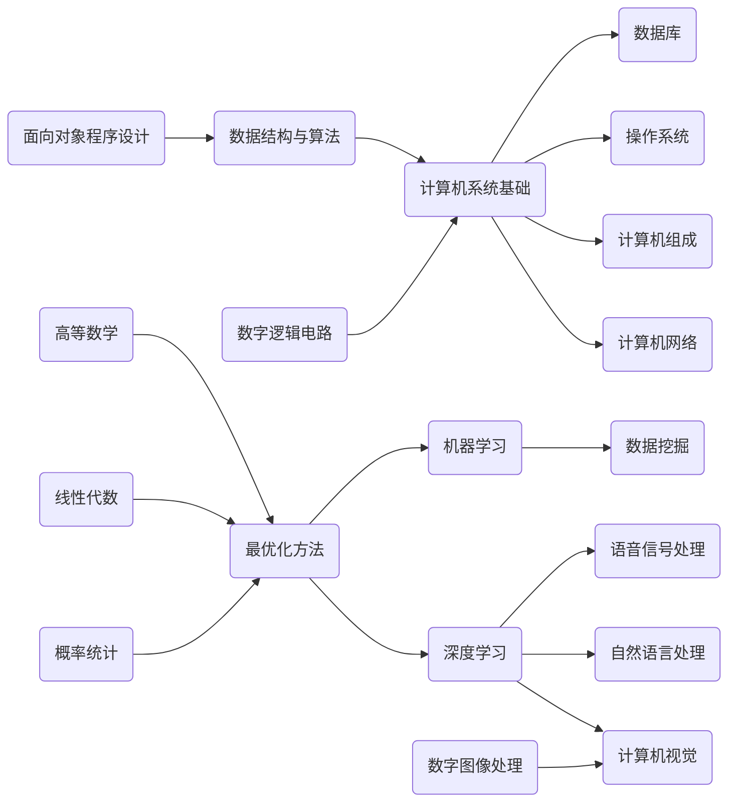

!!! quote "宋 · 苏轼《稼说送张琥》"
    博观而约取，厚积而薄发。

本栏目文章以「计算机、人工智能的理论知识」为主，欢迎在页面底部进行评论与互动。

```mermaid
flowchart LR
    %% 实体定义
    面向对象程序设计(面向对象程序设计)
    数据结构与算法(数据结构与算法)
    数字逻辑电路(数字逻辑电路)
    计算机系统基础(计算机系统基础)
    数据库(数据库)
    操作系统(操作系统)
    计算机组成(计算机组成)
    计算机网络(计算机网络)

    %% 关系定义
    面向对象程序设计 --> 数据结构与算法 --> 计算机系统基础
    数字逻辑电路 --> 计算机系统基础 --> 数据库 & 操作系统 & 计算机组成 & 计算机网络

    %% 实体定义
    数字图像处理(数字图像处理)
    机器学习(机器学习)
    深度学习(深度学习)
    数据挖掘(数据挖掘)
    自然语言处理(自然语言处理)
    计算机视觉(计算机视觉)
    语音信号处理(语音信号处理)

    %% 关系定义
    机器学习 --> 数据挖掘
    深度学习 --> 语音信号处理 & 自然语言处理 & 计算机视觉
    数字图像处理 --> 计算机视觉

    %% 实体定义
    高等数学(高等数学)
    线性代数(线性代数)
    概率统计(概率统计)
    最优化方法(最优化方法)

    %% 关系定义
    高等数学 & 线性代数 & 概率统计 --> 最优化方法 --> 机器学习 & 深度学习

    %% 跳转链接
    click 高等数学 "./math/advanced-math/"
    click 线性代数 "./math/linear-algebra/"
    click 概率统计 "./math/probability-and-statistics/"
    click 最优化方法 "./math/optimization-method/"

    click 面向对象程序设计 "./cs/object-oriented-programming/"
    click 数字逻辑电路 "./cs/digital-logic-circuit/"
    click 计算机系统基础 "./cs/computer-system-basic/"
    click 数据库 "./cs/database/"
    click 数据结构与算法 "./ds-and-algo/"
    click 操作系统 "./cs/operating-system/"
    click 计算机组成 "./cs/computer-organization/"
    click 计算机网络 "./cs/computer-network/"

    click 数字图像处理 "./ai/digital-image-processing/"
    click 机器学习 "./ai/machine-learning/"
    click 数据挖掘 "./ai/data-mining/"
    click 深度学习 "./ai/deep-learning/"
    click 语音信号处理 "./ai/speech-signal-processing/"
    click 自然语言处理 "./ai/natural-language-processing/"
    click 计算机视觉 "./ai/computer-vision/"
```

<caption> 专栏内容拓扑图（可点击跳转） </caption>

