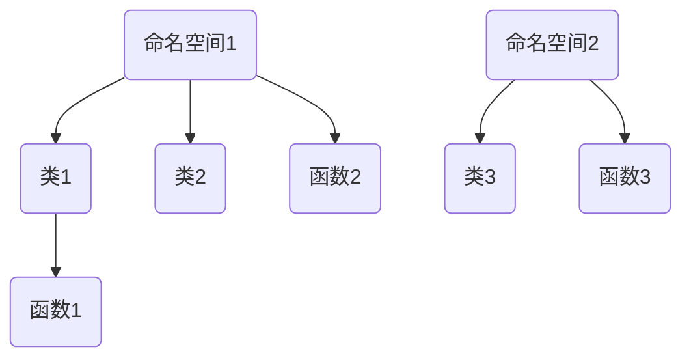

本文介绍 C++ 的一些基本概念。

## 编译器

编译器 (Compiler) 是将人类可读的 C++ 源代码（例如 `.cpp` 和 `.h` 文件）转换成计算机可以执行的机器码（可执行文件）的程序。常见的 C++ 编译器如下表所示：

| 编译器 | 全称 | 支持的平台 | 备注 |
| :--- | :--- | :--- | :--- |
| [GCC](https://gcc.gnu.org/) | GNU Compiler Collection | Linux, macOS,  Windows (MinGW/Cygwin/WSL) | 开源世界的标准 |
| Clang | / | Linux, macOS, Windows | 作为底层虚拟机 (Low Level Virtual Machine, LLVM) 项目的一部分，以其快速的编译速度、模块化设计和友好的错误提示而闻名 |
| MSVC | Microsoft Visual C++ | Windows | 集成在 Visual Studio 中 |

### 安装

直接找到对应的官网按照文档下载安装即可，可以参考 [一文搞懂 C/C++ 常用编译器](https://www.cnblogs.com/luoweifu/p/18348981) 这篇博客。也可以直接安装 Visual Studio 和 CLion 等集成开发环境。

### 与 C++ 标准关系

C++ 标准会不断改进，这意味着编译器也需要升级以支持最新的 C++ 标准，因此才会看到诸如 `C++14`、`C++23` 等形式的 C++ 标准，后面的数字表示标注发布的年份。

编译器的型号也就会不断改变，例如 GCC 的 `gcc 12.2`、`gcc 13.4` 等版本。

例如我的 Windows 笔记本下载的 CLion 对应的编译器就是 GCC 的 Windows 适配版 MinGW。在终端输入 `gcc --version` 后打印的版本为 `gcc 13.1.0`。

## 命名空间

在 C++ 中，代码的组织结构如下所示：



类涉及到面向对象编程，函数就是 C 语言中最基本的函数，这里简单介绍一下命名空间的概念。

每一个命名空间下都可以自定义各种类与函数。如果不声明命名空间，则自定义的类与函数就归属到全局命名空间。标准库的命名空间为 `std`，可以通过使用命名空间域作用符 `::` 使用。

### std

下面的程序展示了标准库 (Standard Library) 命名空间的声明规范：

```cpp
#include <compare>
#include <initializer_list>
#include <ios>
#include <streambuf>
#include <istream>
#include <ostream>

namespace std {
  // 数学函数(连带勒让德多项式) math.h
  assoc_legendre(unsigned l, unsigned m, x);
  float assoc_legendref(unsigned l, unsigned m, float x);
  long double assoc_legendrel(unsigned l, unsigned m, long double x);
  
  // 动态数组类 vector
  template<class T, class Allocator = allocator<T>> class vector;
 
  template<class T, class Allocator>
    constexpr bool operator==(const vector<T, Allocator>& x,
                              const vector<T, Allocator>& y);
  
  // 输入输出类 iostream
  extern istream cin;
  extern ostream cout;
  extern ostream cerr;
}
```

### 自定义命名空间

也可以自定义命名空间：

```cpp
// myLibrary - eat

#include <iostream>

namespace myLibrary {
    // eat class
    class eat {
    private:
        char namep[4];
        int age;

    public:
        void fun();
        void step();
    };

    // eat function
    void go();
}
```

甚至可以嵌套命名空间：

```cpp
// anotherLibrary - study

#include <iostream>

namespace anotherLibrary {
    class who {};
    class what {};
    class how {};
    
    void open();
    void close();
    
    // insert namespace
    namespace secondLibrary {
        class where {};
        class which {};
        void write(int a, int b);
    }
}
```

- 如果需要使用第一层命名空间中的类或函数，语法如；`anotherLibrary::who myClass;`
- 如果需要使用嵌套的命名空间中的类或函数，语法如：`anotherLibrary::secondLibrary::write(1, 2);`

### using

我们可以通过 `using` 关键字将指定的命名空间引入 **当前作用域** 中，从而可以省略 `::` 的使用：

```cpp
#include <iostream>
#include <vector>

int fun(int num) {
    using namespace std;
    
    vector<int> a(num + 1);
    int sum = 0;
    for (int i = 1; i <= num; i++) a[i] = i;
    for (int i = 1; i <= num; i++) sum += a[i];
    
    return sum;
}

int main() {
    std::cout << fun(10) << std::endl;
    
    return 0;
}
```

上述程序中，`std` 命名空间被显式的在 `fun` 函数作用域中标出了，所以可以直接使用 `vector` 而不用写成 `std::vector`。但是在 `main` 函数作用域中没有显式的标出 std 故还是需要使用 `std::` 才能使用该命名空间中定义的类或方法，此处为输入输出类的 `std::cout` 与 `std::endl`。

## 模块化开发

当项目规模变大时，将所有代码放在一个文件中是不可行的，此时就可以通过模块化的方式提高代码的可读性、复用性和可维护性。

### 头文件 `.h`

- 用于存放 **声明**，如：函数原型、类定义、宏定义、全局变量的 `extern` 声明等；
- 通过 `#include` 指令被源文件或其他头文件包含。
- 通常使用 `#pragma once` 或 `#ifndef...#define...#endif` 来防止头文件被重复包含。

### 源文件 `.cpp`

- 用于存放 **定义**，如：函数的具体实现、类成员函数的实现、全局变量的定义和初始化等；
- 每个源文件通常会 `#include` 其对应的头文件以及其他需要的头文件。

### 示例

`demo.h` 文件：

```cpp
#include <iostream>

class demo {
private:
    int classVar;

public:
    void classFun();
};
```

`demo.cpp` 文件：

```cpp
#include "demo.h"
#include <iostream>

void demo::classFun() {
    std::cout << "classFunction" << std::endl;
}
```

`main.cpp` 文件：

```cpp
#include "demo.h"

int main() {
    demo obj;
    obj.classFun();

    return 0;
}
```

控制台正常输出：

```text
classFunction
```

我们知道在 python 中，导入一个模块后除了可以使用模块的类，还可以直接调用模块文件中的函数，那么在 C++ 文件中也可以这样吗？答案是可以的。

我们在上述 demo 类的下面继续添加函数：

```cpp
#include <iostream>

class demo {
private:
    int classVar;

public:
    void classFun();
};

void globalFun() {
    std::cout << "globalFunction" << std::endl;
}
```

编译报错：`multiple definition of globalFun()`。

即重定义错误。解决方法有两个：

1. 将函数定义写在 `.cpp` 文件中，`.h` 文件只包含函数声明；
2. 将函数写成内联函数的形式（直接在函数返回值前面加上 `inline` 关键字）。

**为什么内联函数不会产生函数重定义问题**？

- 非内联函数会引发重定义错误是因为引用 `.h` 文件时，如果一个函数被定义，那么引用该 `.h` 的文件中都会包含这个函数的定义，由于每个函数（包括全局变量）只能有一个定义，那么很显然在编译链接时就会报重定义的错；
- 当函数被声明为内联时，编译器虽然也会将其插入到每个调用该函数的地方，但链接器知道这是内联函数，可以合并成同一个函数实体，不会当作“重定义”。

**为什么 `.h` 文件可以直接定义类的成员函数而不会出现重定义问题**？C++ 中的类成员函数默认是内联的。但是不推荐这种直接定义成员函数的方法，因为这会导致编译时代码膨胀（每个调用的地方都会被插入函数代码），故多文件编程的规范就是：无论是类的成员函数还是全局函数，函数的声明都写在 `.h` 文件中，而对于这些函数声明的定义都写在相同文件名的 `.cpp` 文件中。

## 库

我们知道 C++ 编译器在下载时会自带一些功能代码，我们将其称为标准库 (Standard Library)，但毕竟功能有限。为了实现特定功能（如图形渲染、网络通信、数学计算等）从而提高开发效率，各种 C++ 第三方库被开发了出来。第三方库指的就是预先编写好的、可重用的代码集合。

### 库的种类

分两种，分别是静态库 (Static Library) 和动态库 (Dynamic/Shared Library)。具体情况如下表对比：

|        | 文件后缀                                             | 链接方式                                                     | 优点                                                         | 缺点                                                       |
| ------ | ---------------------------------------------------- | ------------------------------------------------------------ | ------------------------------------------------------------ | ---------------------------------------------------------- |
| 静态库 | Windows 是 `.lib`，Linux/macOS 是 `.a`               | 在链接阶段，库中被用到的代码会被完整地复制到最终生成的可执行文件中 | 部署简单，因为可执行文件是自包含的，不依赖外部库文件         | 可执行文件体积较大；如果库更新了，整个项目需要重新编译链接 |
| 动态库 | Windows 是 `.dll`，Linux 是 `.so`，macOS 是 `.dylib` | 在链接阶段，只记录库的引用信息。当程序运行时，操作系统会负责将动态库加载到内存中，并与程序建立连接 | **节省空间**，因为多个程序可以共享同一个动态库的内存副本；**更新方便**，因为更新动态库文件无需重新编译所有使用它的程序（只要接口保持兼容） | 部署时需要确保可执行文件能找到所需的 `.dll` 或 `.so` 文件  |

### 库的使用

流程如下：

1. 获取库：通过包管理器（如 [vcpkg](https://vcpkg.io/), [Conan](https://conan.io/) 等）自动下载和集成，或者手动从官网下载预编译版本或源码；
2. 配置项目：告诉编译器和链接器在哪里找到库：
    - 头文件路径：指定库的头文件所在的目录，以便 `#include` 能找到它们；
    - 库文件路径：指定 `.lib` 或 `.so` 文件所在的目录；
    - 要链接的库：告诉链接器要链接哪些具体的库文件；
3. 包含头文件并使用：在代码中 `#include` 相应的头文件，然后就可以像使用标准库一样调用库提供的函数和类。
