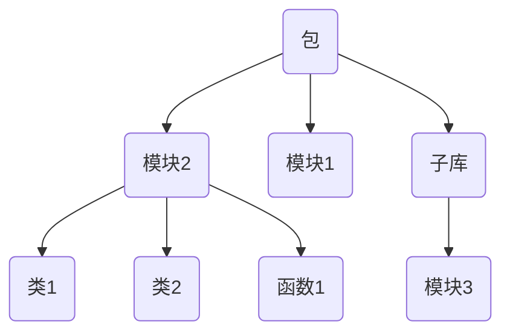

本文记录 [Python](https://www.python.org/) 的基本概念。

## 安装 Python

安装 Python 的方法有很多，主要有以下几种：

- 【新人小白推荐】基于 [Python 安装包](https://www.python.org/downloads/) 管理 Python；
- 【数据科学推荐】基于 conda 管理 Python；
- 【现代工程推荐】基于 uv 管理 Python。

后两种方法详见 [环境管理](#环境管理)。

## 解释器

Python 是一门解释型语言，代码不会被提前编译成机器码，而是由解释器在运行时逐行转换并执行。解释器会先将 `.py` 代码转换为 `.pyc` 字节码，然后逐行执行字节码得到运行结果。根据场景的不同，执行字节码的实现也不同，目前主流的有以下几种实现：

| 实现    | 开发语言 | 字节码执行方式                                    | 特点                                  | 典型应用场景                        |
| ------- | -------- | ---------------------------------------------- | ----------------------------------------- | ----------------------------------- |
| CPython | C        | 逐条解释  | 官方标准实现，生态最全，速度中等      | 默认实现、科研计算、Web 后端等     |
| PyPy    | Python | 逐条解释，但会在运行时将热点字节码即时 (Just In Time, JIT) 编译为机器码，直接在 CPU 上执行 | 执行速度快，适合长时间运行的计算任务；但兼容性稍差 | 高性能计算、高并发等                 |
| Jython  | Java     | 将 Python 源码直接编译成 Java 字节码，然后由 JVM（Java 虚拟机）执行 | 能与 Java 无缝集成；但性能依赖 JVM 优化，启动速度稍慢 | 需要在 Java 环境中使用 Python 脚本 |

## 包

Python 以包 (Package) 的形式组织不同的功能模块，每一个 `.py` 文件就是一个模块，模块中含有对应的类和函数。可以简单地将 Python 中的包与 [C++ 中的命名空间](../cpp/index.md#命名空间) 类比——同一个包中不可出现同名模块，不同的包中可以出现同名模块。

Python Package 的基本结构如下图所示：



得益于 Python 便捷的开发逻辑，其第三方包相当丰富。包分发系统 (Python Package Index, [PyPI](https://pypi.org/)) 可以非常便捷地分发和管理第三方包。

## 环境管理

一般来说，对于一个规范的 Python 工程，都需要确保能够被复现，此时就需要用上 Python 环境管理工具了。目前主流的主要有以下几个：

- [`pip`](https://github.com/pypa/pip)。Python 自带的包管理工具。特点：轻量、传统、兼容性好，但速度较慢；
- [`conda`](https://github.com/conda/conda)。Anaconda 和 Miniconda 的包与环境管理工具，其中 Miniconda 是 Anaconda 的精简版，推荐使用 Miniconda。与 `pip` 不同的是，`conda` 不仅可以以虚拟环境的形式管理 Python 包，还能很方便地管理 Python 版本。这对于很多对 Python 版本有要求的项目来说很方便。特点：强大、跨语言、数据科学常用，但相对臃肿；
- [`uv`](https://github.com/astral-sh/uv)。一个超高速的 Python 包与环境管理工具。它的设计目标是成为 `pip` + `venv` + `virtualenv` + `pip-tools` + `pipx` 的统一替代品，同时兼具 Rust 语言的高性能和 Python 工具的灵活性。特点：新一代工具，统一包管理与环境管理，速度极快，未来有望成为主流。

### 工具的安装与配置

基本安装方法：

=== "pip"

    安装 Python 时自带，无需额外安装。如果没有，可以手动安装：
    
    ```bash
    python -m ensurepip --upgrade
    ```

=== "conda"

    以在 Linux 系统安装 Miniconda 为例，其他系统上的安装方法见 [Anaconda](https://www.anaconda.com/docs/getting-started/miniconda/install) 官网）：
    
    ```bash
    # 创建安装目录（自定义）
    mkdir -p ~/software/miniconda3
    
    # 下载安装脚本
    wget https://repo.anaconda.com/miniconda/Miniconda3-latest-Linux-x86_64.sh -O ~/software/miniconda3/miniconda.sh
    
    # 下载并安装
    bash ~/software/miniconda3/miniconda.sh -b -u -p ~/software/miniconda3
    
    # 删除安装脚本（可选）
    rm ~/software/miniconda3/miniconda.sh
    ```

=== "uv"

    对于 Windows 用户，最简单的方法是直接下载 uv 的二进制程序：
    
    1. 进入 uv 的 [GitHub Releases](https://github.com/astral-sh/uv/releases) 界面；
    
    2. 下载适合你电脑芯片的压缩包。例如对于 64 位的 Windows，选择 `uv-x86_64-pc-windows-msvc.zip` 即可；
    
    3. 将压缩包解压后，将对应目录添加到系统环境变量中。
    
    4. 检查是否安装成功。在终端输入以下命令：
    
        ```bash
        uv --version
        ```
    
        如果可以正常打印 uv 的版本号信息，即表示安装成功。
    
    5. 更多安装方法见 [uv docs](https://docs.astral.sh/uv/getting-started/installation/)。

基本配置方法：

=== "pip"

    ```bash
    # 查看 pip 的配置（添加 -v 参数显示配置文件路径）
    pip config list
    
    # 设置配置
    pip config set <level>.<key> <value>
    
    # 取消配置
    pip config unset <level>.<key>
    ```

=== "conda"

    ```bash
    # 查看所有的配置文件及其配置
    conda config --show-sources
    ```

=== "uv"

    uv 没有 config 子命令一说，各种配置都被拆解为对应的子命令了，强烈建议使用 `uv --help` 查看各种命令的用法。关于配置的查询顺序和优先级，详见 [uv | Configuration files](https://docs.astral.sh/uv/concepts/configuration-files/) 官方文档。

配置下载源：

=== "pip"

    ```bash
    # 临时换源
    pip install <PackageName> -i https://pypi.tuna.tsinghua.edu.cn/simple/
    
    # 永久换源
    pip config set global.index-url https://pypi.tuna.tsinghua.edu.cn/simple/
    
    # 查看当前源设置
    pip cogfig list
    
    # 恢复默认源
    pip config unset global.index-url
    ```

=== "conda"

    ```bash
    # 临时换源
    conda install <pkg> -c https://mirrors.tuna.tsinghua.edu.cn/anaconda/pkgs/main/
    
    # 永久换源
    conda config --add channels https://mirrors.tuna.tsinghua.edu.cn/anaconda/pkgs/main/
    conda config --add channels https://mirrors.tuna.tsinghua.edu.cn/anaconda/pkgs/free/
    conda config --set show_channel_urls yes
    
    # 查看当前源设置
    conda config --show
    
    # 恢复默认源
    conda config --remove-key channels
    ```

=== "uv"

    ```bash
    # 临时换源
    uv add requests --index https://pypi.tuna.tsinghua.edu.cn/simple/
    
    # 项目级换源
    # 编辑项目目录下的 pyproject.toml 文件
    [[tool.uv.index]]
    url = "https://pypi.tuna.tsinghua.edu.cn/simple/"
    default = true
    
    # 用户级换源
    # 根据 https://docs.astral.sh/uv/concepts/configuration-files/ 的指引找到当前系统存储的 uv.toml 并编辑
    [[index]]
    url = "https://pypi.tuna.tsinghua.edu.cn/simple/"
    default = true
    
    # 系统级换源
    # 编辑环境变量 UV_DEFAULT_INDEX=https://pypi.tuna.tsinghua.edu.cn/simple/
    ```

管理缓存：

=== "pip"

    ```bash
    # 显示缓存路径
    pip cache dir
    
    # 显示缓存信息（包括路径、大小、数量等）
    pip cache info
    
    # 清空缓存
    pip cache purge
    
    # 配置缓存路径
    pip config set global.cache-dir <path/to/cache/folder>
    ```

=== "conda"

    ```bash
    # 清空缓存
    conda clean --all
    ```

=== "uv"

    ```bash
    # 显示缓存路径
    uv cache dir
    
    # 显示缓存大小（-H 表示符合人类习惯）
    uv cache size -H
    
    # 清空缓存
    uv cache clean
    
    # 配置缓存路径
    # 在环境变量中设置 UV_CACHE_DIR
    ```

### 管理虚拟环境

不同的项目往往依赖不同的包，为了避免出现包的版本冲突，一般推荐按照项目进行包的隔离，隔离出来的环境被称作虚拟环境。所谓虚拟环境，本质上就是拷贝（或链接）一个 Python 解释器，然后将各种包安装在指定目录下，从而起到了隔离的效果。

!!! tip
    虚拟环境并不代表根解释器的完全拷贝，有些项目无关的文件并不会拷贝，所以不能删除根解释器。

基本操作：

=== "pip"

    无法管理，但是可以借助 Python 自带的 `venv` 库。
    
    ```bash
    # 创建环境
    python -m venv <VenvFolderName>
    
    # 激活环境 (Windows)
    .\<VenvFolderName>\Scripts\activate
    
    # 激活环境 (Linux)
    source ./<VenvFolderName>/bin/activate
    
    # 退出环境
    deactivate
    ```

=== "conda"

    ```bash
    # 查看环境
    conda env list
    
    # 创建环境
    conda create -n <env_name> python=<python_version>
    
    # 激活 base 环境（方法一）
    source ~/software/miniconda3/bin/activate
    
    # 激活 base 环境（方法二）
    source activate base
    
    # 激活自定义的环境
    conda activate <env_name>
    
    # 退出环境
    conda deactivate
    
    # 删除环境
    conda remove -n <env_name> --all
    ```

=== "uv"

    使用 uv 初始化项目会自动生成一个虚拟环境目录：
    
    ```bash
    uv init
    ```
    
    当然也可以用下面的方法来更定制化的管理：
    
    ```bash
    # 创建环境
    uv venv <env_folder>
    
    # 激活环境
    source <env_folder>/bin/activate   # Linux / macOS
    .\<env_folder>\Scripts\activate    # Windows
    
    # 删除环境
    rm -rf <env_folder>
    ```

环境同步：

=== "pip"

    ```bash
    # 导出环境
    pip freeze > requirements.txt
    
    # 复现环境
    pip install -r requirements.txt
    ```

=== "conda"

    ```bash
    # 导出环境
    conda env export > environment.yml
    
    # 复现环境
    conda env create -f environment.yml
    ```

=== "uv"

    用 `uv add`、`uv remove` 命令管理包时，`uv` 会自动维护两个文件：
    
    - `pyproject.toml`：记录你手动添加的顶层依赖（即你显式安装的包）；
    - `uv.lock`：记录完整的锁定依赖树（所有版本、所有子依赖、哈希等）。
    
    ```bash
    # 复现环境
    uv sync
    ```

### 管理解释器

=== "pip"

    无法管理 Python 版本，只能依赖已有的 Python。

=== "conda"

    可以在创建虚拟环境的时候指定 Python 版本，详见 [管理虚拟环境](#管理虚拟环境)。

=== "uv"

    ```bash
    # 查询可下载的 Python 版本
    uv python list
    
    # 下载指定版本的 Python
    uv python install <python_version>
    
    # 固定项目使用的 Python 版本，之后会在项目目录下生成一个 .python-version 的文本文件
    uv python pin <python_version>
    
    # 将 Python 二进制程序加入用户环境变量
    uv python update-shell
    
    # 激活虚拟环境后即可使用对应 Python 了
    uv init
    uv add request
    ...
    
    # 删除指定版本的 Python
    uv python uninstall <python_version>
    ```

### 管理包

如果使用了 [虚拟环境](#管理虚拟环境)，请在管理包之前提前激活虚拟环境。

=== "pip"

    查看包：
    
    ```bash
    # 查看已安装的包
    pip list
    
    # 查看包信息
    pip show <pkg>
    
    # 查看包文件
    pip show -f <pkg>
    ```
    
    安装与卸载：
    
    ```bash
    # 安装包
    pip install [options] <pkg>
    
    # 安装包（安装指定版本）
    pip install <pkg>==<version>
    
    # 安装包（从文件中读取包列表）
    pip install -r <file_name>
    
    # 安装包（同时安装扩展）
    pip install <pkg>[<plugin>]  # 例如 pip install "imageio[ffmpeg]"
    
    # 安装包（从 Git 项目下载，可指定分支或提交）
    pip install git+https://github.com/<username>/<repo>.git[@<branch>]
    pip install git+https://github.com/<username>/<repo>.git[@<commit_id>]
    
    # 安装包（强制安装最新版，--upgrade 可简写为 -U）
    pip install --upgrade <pkg>
    
    # 安装包（强制重新安装）
    pip install --force-reinstall <pkg>
    
    # 安装包（禁止独立安装，适用于非纯 Python 包）
    pip install --no-build-isolation <pkg>
    
    # 卸载包
    pip uninstall <pkg>
    ```

=== "conda"

    查看包：
    
    ```bash
    # 查看安装的包列表
    conda list
    ```
    
    安装与卸载：
    
    ```bash
    # 安装包
    conda install <pkg>
    
    # 安装包（安装指定版本，注意只有一个等号）
    conda install <pkg>=<version>
    
    # 卸载包（方法一）
    conda uninstall <pkg>
    
    # 卸载包（方法二）
    conda remove <pkg>
    ```

=== "uv"

    安装与卸载包：
    
    ```bash
    # 安装包
    uv add [options] <pkg>
    
    # 安装包（安装指定版本）
    uv add <pkg>==<version>
    
    # 安装包（从文件中读取包列表）
    uv add -r <filename>
    
    # 安装包（从 git 源码安装）
    # 前提得有构建文件：setup.py 或 pyproject.toml 或 setup.cfg
    uv add git+https://github.com/thu-ml/SLA.git
    
    # 卸载包
    uv remove <pkg>
    ```
    
    对于有前置依赖的包（禁止独立安装），可以在 `pyproject.toml` 中添加以下内容：
    
    ```toml hl_lines="9-10"
    [project]
    name = "project"
    version = "0.1.0"
    description = "..."
    readme = "README.md"
    requires-python = ">=3.12"
    dependencies = ["cchardet", "cython", "setuptools"]
    
    [tool.uv]
    no-build-isolation-package = ["cchardet"]
    ```
    
    更新包：
    
    ```bash
    # 更新全部包
    uv lock --upgrade
    
    # 更新指定包
    uv lock --upgrade-package <pkg>
    ```

## 代码管理🤨

环境配置好后，就开始 coding 啦！但是在开始 coding 之前，需要提前做好代码的规范化配置，这有助于更高效地编写出更健壮的代码。

### 代码格式化

即 formatter，推荐 ruff

### 代码检查

即 linter，推荐 ruff

### 类型检查

推荐 ty

### 测试

推荐 pytest

### 注释

VSCode 插件：autoDocstring

PyCharm：自动 docstring 模板

## PEP

Python 增强提案 (Python Enhancement Proposal, PEP) 是 Python 社区用来规范 Python 语言的。下面罗列一些比较常用的规则。

### PEP 503: Simple Repository API

2015 年 Python 社区提出了 [包名标准化](https://peps.python.org/pep-0503/) 制度：

- 所有单个或连续的 `- . _` 字符都会被替换为单个 `-` 字符；
- 所有字母都会被转化为小写字母。

例如 `FLASH-atTn`、`flash_attn`、`flash___attn` 等都会被解释为 `flash-attn`。

## 导入机制

在 Python 中，模块化开发的核心思想是将代码拆分为多个模块 `module` 和包 `package`，通过导入机制复用和组织代码，因此了解导入机制非常重要。

以下面的项目结构为例：

```bash
my_project/
│
├── main.py          # 主程序
├── utils.py         # 模块
└── pkg/             # 包
    ├── __init__.py  # 包初始化模块，从 Python 3.3 开始不强制写了
    ├── math_utils.py
    └── string_utils.py
```

### 模块的搜索顺序

当用 `import xxx` 尝试导入某一个模块时，Python 会按以下顺序搜索模块：

1. **当前执行脚本所在目录**。例如执行 `python main.py` 时，解释器会先在 `my_project` 中找；
2. **环境变量 `PYTHONPATH` 指定的路径**。可以通过 `export PYTHONPATH=/path/to/mylibs` 指定；
3. **标准包路径**。Python 自带的包，如 `os`、`sys` 等；
4. **第三方包路径**。通过 `pip install` 安装的库都在这里，即 `site-packages` 目录。

可以打印 `sys.path` 列表查看解释器的模块搜索路径：


可以看到解释器的确按照上述顺序搜索模块。其中空字符串就表示项目所在根目录，对于示例项目，就是 `/path/to/my_project`。

注意：PYTHONPATH $\ne$ 虚拟环境激活。

- 设置 `PYTHONPATH` 只是告诉解释器额外去某个目录找模块，并没有改变 Python 的运行环境。
- 虚拟环境在激活时，会做的不仅仅是修改 `PYTHONPATH`，它还会：
    1. 改变 `sys.prefix` 和 `sys.executable`，让解释器以虚拟环境为主；
    2. 注入 `sitecustomize.py` 和 `site.py` 的钩子，使包索引、依赖解析与虚拟环境匹配；
    3. 修改动态链接库的搜索路径。

### 模块的导入方式

分绝对导入和相对导入两种。

**绝对导入**。从项目根目录开始写路径，可以保证路径清晰，适合跨包引用。例如：

```python
# main.py
from pkg import math_utils
from pkg.string_utils import clean_text
```

**相对导入**。基于当前模块所在位置，使用 `.` 或 `..` 来表示相对路径，便于包的内部维护。例如：

```python
# 在 pkg/math_utils.py 内
from .. import utils             # 导入上一级目录的模块
from . import string_utils       # 导入同级模块
from .string_utils import cos    # 导入同级模块的函数
```

### 关于 `__name__`

在 Python 的导入与运行机制中，`__name__` 变量起着关键作用，它决定了当前模块在解释器眼中的身份。而决定 `__name__` 变量取值的，在于模块的运行方式。

**直接运行模块**。例如，使用 `python path/to/my_project/pkg/math_utils.py` 运行模块 `math_utils.py` 时：

- 模块身份。此时 `math_utils.py` 的 `__name__ = '__main__'`，解释器认为它是“顶层脚本”，而不是 `pkg` 包中的子模块；

- 搜索路径。Python 会将当前文件所在目录作为根目录，即 `sys.path[0] = path/to/my_project/pkg`。在解释器眼中，`pkg` 不是一个包，而只是一个普通目录；

- 运行结果：

    - 如果使用「绝对导入」，只能导入 `pkg` 目录下的模块；若试图导入外层模块，会报错：

        ```text
        ModuleNotFoundError
        ```

    - 如果使用「相对导入」，会报错：

        ```text
        ImportError: attempted relative import with no known parent package
        ```

        因为 Python 此时并不知道 `math_utils.py` 有“父包”，它被当成独立文件执行。

**通过 `-m` 参数运行模块**。例如，使用 `python -m pkg.math_utils` 运行模块 `math_utils.py` 时：

- 模块身份。此时 `math_utils.py` 的 `__name__ = '__main__'`，但仍属于 `pkg` 包的子模块；
- 搜索路径。Python 会将执行命令的当前目录作为根目录，即 `sys.path[0] = path/to/my_project`。解释器能正确识别 `pkg` 是顶层包；
- 运行结果。绝对导入、相对导入都能正常工作。

**`if __name__ == '__main__'` 的应用场景**。在实际开发中，包内子模块往往既要被其他模块导入，又希望能够单独测试。此时我们通常会在模块末尾写：

```python
if __name__ == '__main__':
    # 测试代码
    obj = SomeClass()
    obj.run()
```

这样当模块被 `import` 时，测试代码不会执行；当使用 `python -m pkg.math_utils` 运行时，测试代码才会执行，从而实现子模块的“就地单测”。

**总结一下**。直接运行文件时，解释器眼里它是孤立的脚本；用 `-m` 运行时，它才是包的一部分：

- 导入规则：顶层模块「必须」使用绝对导入；包内模块之间「最好」使用相对导入；
- 运行规则：顶层脚本「可以」直接 `python xxx.py` 运行；使用相对导入的包内子模块「必须」增加 `-m` 参数运行。

## 变量与作用域

理解作用域是理解一门编程语言的开始，这里就以变量为载体，结合与 C++ 的对比进行讲解。

### 变量引用

在 C++ 和 Python 中，赋值语句的语义是完全不同的。类比：C++ 变量像「盒子」，赋值就是再拿一个盒子装一份拷贝；而 Python 变量像「标签」，赋值就是多贴几个标签在同一个盒子上。下图生动的展示了 Python 变量的意义：


**C++：赋值会产生拷贝（盒子模型）**。给变量赋值时，会重新申请内存空间，把数据复制过去。

例如下面的程序。输出的内存地址不同，说明 `a` 和 `b` 是两份独立的数据。：

```cpp
#include <iostream>
#include <vector>

int main() {
    std::vector<int> a = {1, 2, 3};
    std::vector<int> b = a;

    std::cout << &a << std::endl;  // 0x8b5a3ffa40
    std::cout << &b << std::endl;  // 0x8b5a3ffa20
    return 0;
}
```

**Python：赋值仅仅是增加引用（标签模型）**。所有变量其实都是「标签」，指向同一块数据。

例如下面的程序。三个变量的内存地址完全一样，说明它们指向同一份数据：

```python
a = [1, 2, 3]
b = a
c = a
print(id(a))  # 1542586187072
print(id(b))  # 1542586187072
print(id(c))  # 1542586187072
```

### 可变与不可变类型

理解引用后，关键在于弄清修改变量时会发生什么，而这与 Python 的数据类型息息相关。Python 的数据类型分「可变」和「不可变」两类。

**可变类型（列表 `list`、字典 `dict`、集合 `set`）**。修改操作为原地修改，不会新开内存，因此所有引用同时生效。

例如下面的程序。修改了其中一个变量的值以后，三个可变数据类型变量 $a,b,c$ 指向的内存空间没有发生改变，同时其余所有变量也都跟着改变：

```python
a = [1, 2, 3]
b = a
c = b
print(id(a))  # 1441782879424
print(id(b))  # 1441782879424
print(id(c))  # 1441782879424

# a[0] = -1 和 b[0] = -1 效果都是一样的
c[0] = -1

print(id(a))  # 1441782879424
print(id(b))  # 1441782879424
print(id(c))  # 1441782879424

print(a)  # [-1, 2, 3]
print(b)  # [-1, 2, 3]
print(c)  # [-1, 2, 3]
```

**不可变类型（整数 `int`、浮点数 `float`、字符串 `str`、元组 `tuple`）**。修改操作本质是「重新赋值」，会开辟新内存，原来的数据保持不变。

例如下面的程序。另一个引用变量 $t$ 在进行拼接操作后，对应的内存地址发生了改变，也就是说申请了新的内存空间：

```python
s = "hello"
t = s
print(id(s))  # 2193178293488
print(id(t))  # 2193178293488

t += 'world'
print(id(s))  # 2193178293488
print(id(t))  # 2193178282864
```

### 变量拷贝

因为 Python 的赋值只是引用，所以如果要真正「复制」，需要用 `copy` 模块。该模块有以下两种拷贝模式：

- 浅拷贝 `copy.copy()`：只复制第一层，嵌套的可变元素依然是引用；
- 深拷贝 `copy.deepcopy()`：递归复制，得到一份全新的数据。

例如下面的程序。：

```python
import copy

# 创建一个嵌套列表
origin = [1, 2, [3, 4]]

# 浅拷贝
sliced = original_list[:]  # 列表的特有写法：切片
shallow_copied = copy.copy(origin)

# 深拷贝
deep_copied = copy.deepcopy(origin)

# 修改嵌套列表中的元素
origin[0] = "haha"
origin[2][0] = 'changed'

print("Original list:\t", origin)           # ['haha', 2, ['changed', 4]]
print("Sliced list:\t", sliced)             # [1, 2, ['changed', 4]]
print("Shallow copied:\t", shallow_copied)  # [1, 2, ['changed', 4]]
print("Deep copied:\t", deep_copied)        # [1, 2, [3, 4]]
```

### 变量作用域

Python 查找变量的顺序遵循 LEGB 规则：

1. Local：先查找当前函数内的变量；
2. Enclosing：再查找外层函数的变量；
3. Global：然后查找全局变量；
4. Built-in：最后查找内置变量和其他导入的包中的变量。

当且仅当需要修改外层变量时，才需要显示声明变量的未知。一共有两种：

- `global var1, var2, ...`：显式声明全局变量；
- `nonlocal var1, var2, ...`：显式声明往外一层函数的变量。

例如下面的程序：

```python
global_count = 0
def outer():
    nonlocal_count = 10
    def inner():
        global global_count      # 显式声明全局变量
        nonlocal nonlocal_count  # 显式声明外层函数的变量
        global_count += 1
        nonlocal_count += 1
    inner()
    print("nonlocal_count =", nonlocal_count)  # 11

outer()
print("global_count =", global_count)  # 1
```

Python 的 class 变量也完全遵守上述规则，只不过增加了两种变量：实例变量和类变量（私有变量和保护变量的作用域涉及到面向对象，和本节讨论的内容无关，不予讨论）。具体地：

- 实例变量：通过 `self.var` 定义，每个实例独立；
- 类变量：直接定义在类中，所有实例共享。

例如下面的程序。不同的类中，类变量的地址是相同的，实例变量的地址不同：

```python
class Dog:
    category = "animal"   # 类变量
    def __init__(self, kind):
        self.category = kind  # 实例变量

dog1 = Dog("x")
dog2 = Dog("y")

print(dog1.__class__.category)  # animal
print(dog2.__class__.category)  # animal
print(dog1.category)  # x
print(dog2.category)  # y
print(id(dog1))  # 2398902522512
print(id(dog2))  # 2398902520016
print(id(dog1.__class__.category))  # 2398902443632
print(id(dog2.__class__.category))  # 2398902443632
print(id(dog1.category))  # 140733327476928
print(id(dog2.category))  # 140733327729768
```
