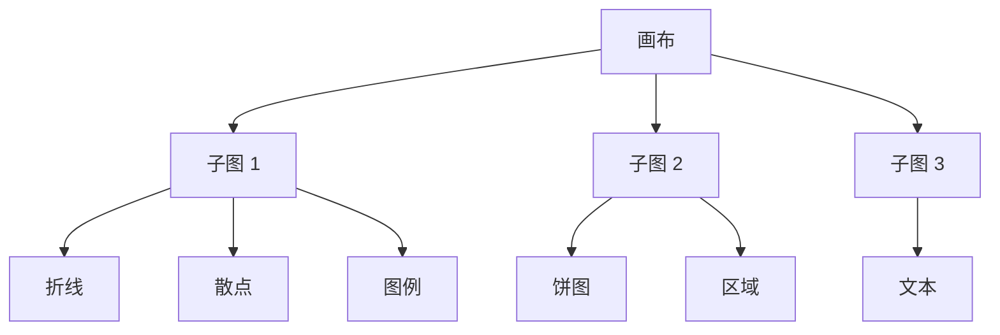

Python 没有内置数据可视化库，但是第三方库比较丰富。本文就以 [Matplotlib](https://matplotlib.org/stable/index.html) 为例。

!!! quote "Matplotlib"
    An object-oriented plotting library.

## 基本概念

### 安装方法

=== "uv"

    ```bash
    uv add matplotlib
    ```

=== "pip"

    ```bash
    pip install matplotlib
    ```

### 设计哲学

仍旧是面向对象。

在 Matplotlib 视角下，一张图由以下几个部分组成：

- Figure（画布）：最顶层的容器，控制整张图的大小、背景色和 DPI；
- Axes（子图）：真正的绘图区域。一个 Figure 可以包含多个 Axes；
- Artist（元素）：子图上所有东西，比如：坐标轴、线条、文字、多边形等都是 Artist 对象。



## 操作画布

画布 (Figure) 是 Matplotlib 的 「根」对象，所有绘图行为最终都落在画布上。

那么很自然的，所有全局级的配置也应当在画布上，比如：

- 尺寸（以英寸为单位）；
- 分辨率（DPI，即每英寸像素数）；
- 全局样式（字体、线宽、调色板）。

### 全局配置

Matplotlib 在导入时会加载一套默认样式，这些配置全部存放在全局样式表字典 `matplotlib.rcParams` 中，所有 Figure / Axes 在创建时，都会从 `rcParams` 中读取默认值：

```python hl_lines="7"
import matplotlib as mpl

mpl.rcParams.update(
    {
        "figure.dpi": 120,  # 运行时 DPI
        "savefig.dpi": 120,  # 持久化 DPI
        "font.family": "SimHei",  # SimHei 支持中文，论文字体一般用 Times New Roman
        "axes.unicode_minus": False,  # 不编码减号
    }
)
```

### 初始化画布

你也许看到过直接用 `plt.plot()` 来绘图的代码，这是因为 Matplotlib 隐式创建了 Figure：

```python
import matplotlib.pyplot as plt

fig = plt.figure(figsize=(8, 4), dpi=100)
```

但我并不推荐这种写法，因为所有的子图 `add_subplot`、元素 `add_axes` 等都需要自定义，容易出错。

我更推荐使用 `plt.subplots` 来初始化画布对象。例如：

```python
fig, ax = plt.subplots(figsize=(8, 5), dpi=120)
```

这种方式方便我们提前创建好子图对象（上述的 `ax`），后续针对 `ax` 绘制元素即可。这种面向对象的方式更符合编码直觉。

### 持久化画布

使用 `matplotlib.pyplot` 的 `savefig` 方法即可。例如：

```python hl_lines="5"
import matplotlib.pyplot as plt

...

plt.savefig("/path/to/image.svg")
```

## 操作子图

子图 (Axes) 是承载数据和坐标系的对象。

### 初始化单子图

```python hl_lines="13"
import matplotlib as mpl
import matplotlib.pyplot as plt

# 全局配置
mpl.rcParams.update(
    {
        "figure.dpi": 80,
        "savefig.dpi": 80,
    }
)

# 创建画布和一个子图
fig, ax = plt.subplots(figsize=(4, 3))

# 绘制元素 - 折线图
ax.plot([1, 2, 3], [1, 4, 9])

# 绘制标题
dpi = fig.get_dpi()
w_inch, h_inch = fig.get_size_inches()
ax.set_title(f"Resolution: {dpi * w_inch:.0f} * {dpi * h_inch:.0f}")

# 持久化画布
plt.savefig("image.svg")
```

输出：


!!! tip "关于 SVG 图像与分辨率"
    我标注分辨率是为了表示图像的大小，但请注意，SVG 没有分辨率一说。

### 初始化多子图

!!! tip "多子图原则"
    每个 Axes 应该是自解释的，不依赖上下文也能读懂。

```python hl_lines="14-19"
import matplotlib as mpl
import matplotlib.pyplot as plt
import numpy as np

# 全局配置
mpl.rcParams.update(
    {
        "figure.dpi": 80,
        "savefig.dpi": 80,
    }
)

# 创建画布和子图
fig, axes = plt.subplots(
    nrows=2,
    ncols=1,
    figsize=(4, 3),
    sharex=False,  # 不共享 X 轴
)

# 示例数据
x = np.linspace(0, 10, 100)
y1 = np.sin(x)
y2 = np.cos(x)

# 在第一个子图绘制折线图 - 正弦曲线
axes[0].plot(x, y1, color="blue")
axes[0].set_title("y = sin(x)")

# 在第二个子图绘制折线图 - 余弦曲线
axes[1].plot(x, y2, color="red")
axes[1].set_title("y = cos(x)")

# 持久化
plt.tight_layout()  # 优化布局
plt.savefig("image.svg")
```

其中 `axes` 是一个 $2\times 1$ 的 `numpy.ndarray`，每个元素都是一个子图实例。

在 `sharex=False` 的情况下进行输出：

=== "`plt.tight_layout()`"

    

=== "`#!python # plt.tight_layout()`"

    

在 `plt.tight_layout()` 的情况下进行输出：

=== "`sharex=True`"

    

=== "`sharex=False`"

    

## 操作元素

子图中一切可见对象，都是 Artist，即元素。每次调用元素创建方法，都会创建一个 Artist 对象并注册到 Axes 的内部列表，最终由 Figure 统一渲染。

常见元素类型有：坐标轴、折线、散点、图例、注释等。

### 绘制坐标轴

我一直称呼 Axes 为子图，但其实它的英文释义是轴。那既然是轴，就可以控制轴的各种属性，比如：范围、刻度、标签、比例等。

设置轴范围：

```python hl_lines="20"
import matplotlib as mpl
import matplotlib.pyplot as plt
import numpy as np

# 全局配置
mpl.rcParams.update(
    {
        "savefig.dpi": 80,
        "figure.dpi": 80,
    }
)

x = np.linspace(0, 20, 200)
y = np.sin(x)

fig, ax = plt.subplots(figsize=(4, 3))
ax.plot(x, y)

# 限制显示范围
ax.set_xlim(0, 10)

plt.savefig("image.svg")
```

=== "`ax.set_xlim(0, 10)`"

    

=== "`#!python # ax.set_xlim(0, 10)`"

    

设置轴刻度：

```python hl_lines="23-24"
import matplotlib as mpl
import matplotlib.pyplot as plt
import numpy as np

# 全局配置
mpl.rcParams.update(
    {
        "savefig.dpi": 80,
        "figure.dpi": 80,
    }
)

x = np.linspace(0, 20, 200)
y = np.sin(x)

fig, ax = plt.subplots()
ax.plot(x, y)

# 设置范围
ax.set_xlim(0, 10)

# 设置刻度
ax.set_xticks([i for i in range(11)])
ax.set_yticks([-1, -0.5, 0, 0.5, 1])

# 自定义标签（标签数量需要和刻度数量一致）
ax.set_yticklabels(["min", "-0.5", "zero", "0.5", "max"])

plt.savefig("image.svg")
```

=== "`ax.set_xticks([i for i in range(11)])`"

    

=== "`#!python # ax.set_xticks([i for i in range(11)])`"

    

设置轴标签：

```python hl_lines="20-21"
import matplotlib as mpl
import matplotlib.pyplot as plt
import numpy as np

# 全局配置
mpl.rcParams.update(
    {
        "savefig.dpi": 80,
        "figure.dpi": 80,
    }
)

x = np.linspace(0, 20, 200)
y = np.sin(x)

fig, ax = plt.subplots(figsize=(4, 3))
ax.plot(x, y)

# 设置轴标签
ax.set_xlabel("Time (s)")
ax.set_ylabel("Amplitude")

plt.tight_layout()
plt.savefig("image.svg")
```

=== "设置标签"

    

=== "不设置标签"

    

设置轴比例：

```python hl_lines="20"
import matplotlib as mpl
import matplotlib.pyplot as plt
import numpy as np

# 全局配置
mpl.rcParams.update(
    {
        "savefig.dpi": 80,
        "figure.dpi": 80,
    }
)

x = np.linspace(0, 20, 200)
y = 2 * x

fig, ax = plt.subplots(figsize=(4, 3))
ax.plot(x, y)

# 设置轴比例
ax.set_yscale("log")

plt.savefig("image.svg")
```

=== "`ax.set_yscale("log")`"

    

=== "`#!python # ax.set_yscale("log")`"

    

### 绘制折线

适合：趋势分析、连续变量。例如：

```python hl_lines="17-22"
import matplotlib as mpl
import matplotlib.pyplot as plt
import numpy as np

# 全局配置
mpl.rcParams.update(
    {
        "savefig.dpi": 80,
        "figure.dpi": 80,
    }
)

x = np.linspace(-3, 3)
y = np.exp(-x)

fig, ax = plt.subplots(figsize=(4, 3))
ax.plot(
    x,
    y,
    linewidth=2,
    linestyle="--",
)

plt.savefig("image.svg")
```

输出：


### 绘制散点

适合：离散样本、分布可视化、聚类结果。例如：

```python hl_lines="17-23"
import matplotlib as mpl
import matplotlib.pyplot as plt
import numpy as np

# 全局配置
mpl.rcParams.update(
    {
        "savefig.dpi": 80,
        "figure.dpi": 80,
    }
)

x = np.linspace(-3, 3)
y = np.exp(-x)

fig, ax = plt.subplots(figsize=(4, 3))
ax.scatter(
    x,
    y,
    c="red",
    s=20,  # 散点大小
    alpha=0.3,  # 透明度
)

plt.savefig("image.svg")
```

输出：


### 绘制图例

适合：提示每一个元素的信息。例如：

```python hl_lines="22 29 34-36"
import matplotlib as mpl
import matplotlib.pyplot as plt
import numpy as np

# 全局配置
mpl.rcParams.update(
    {
        "savefig.dpi": 80,
        "figure.dpi": 80,
    }
)

x = np.linspace(-3, 3)
y_train = np.exp(-x)
y_test = x**2

fig, ax = plt.subplots(figsize=(4, 3))
ax.plot(
    x,
    y_train,
    c="red",
    label="train loss",
    alpha=0.3,
)
ax.plot(
    x,
    y_test,
    c="blue",
    label="test loss",
    alpha=0.3,
)

# 显示标签
plt.legend(
    loc="upper right",  # 显示位置，默认为 "best"
)

plt.savefig("image.svg")
```

输出：


### 绘制注释

适合：强调关键点、解释异常值。例如：

```python hl_lines="27-36"
import matplotlib as mpl
import matplotlib.pyplot as plt
import numpy as np

# 全局配置
mpl.rcParams.update(
    {
        "savefig.dpi": 80,
        "figure.dpi": 80,
    }
)

x = np.linspace(-3, 3)
y_train = np.exp(-x)
y_test = x**2

fig, ax = plt.subplots(figsize=(4, 3))

ax.set_ylim(-1, 3)
ax.plot(x, y_test, c="blue", label="test loss", alpha=0.3)

idx = np.argmin(y_test)
x_min = x[idx]
y_min = y_test[idx]

# 设置注释
ax.annotate(
    f"({x_min:.1f}, {y_min:.1f})",  # 注释文本
    xy=(x_min, y_min),  # 箭头终点
    xytext=(x_min, y_min + 2),  # 箭头起点（注释开始的地方）
    arrowprops=dict(
        arrowstyle="->",  # 箭头样式
        lw=1,  # 箭头粗细
    ),
    fontsize=9,
)

plt.legend()

plt.savefig("image.svg")
```

输出：


!!! quote "沃兹基硕德"
    已经开始幻想自己画出很牛比的图放到论文里了 🤤。
