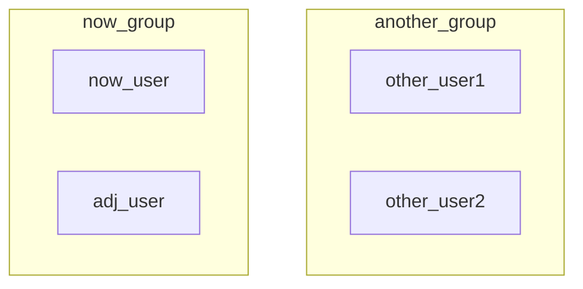

本文记录 GNU/Linux 的学习笔记。其实是学习 GNU 中的各种命令，Linux 内核的东西应该不会碰到。以 Ubuntu 发行版为主。

一些可参考的内容：

- 菜鸟教程：[Linux 命令大全](https://www.runoob.com/linux/linux-command-manual.html)
- 开源社区：[Linux Command](https://github.com/jaywcjlove/linux-command)

## 基本概念

现在大家都称 GNU/Linux 操作系统为 Linux，但其实这是不合理的。因为 Linux 只是这个操作系统的内核（负责硬件管理和资源调度），还需要配合 GNU 的一整套用户程序（包括命令行终端 bash、C 标准库 glibc、C 编译器 GCC 等）才能称得上一个完整的操作系统。

显然，内核不是我们需要考虑的东西，因为我们一般动不了内核，因此我们主要学习的是 GNU/Linux 中的 GNU 部分，即用户程序。至于操作系统的工作原理，不在本文的讨论范围内，感兴趣的读者可以移步基础知识部分的 [操作系统原理](../../base/cs/operating-system/index.md) 进一步阅读。

### Shell 与 Terminal

Terminal 是一个 GUI 界面，让用户直接和操作系统进行交互，而 Shell 是一个解释器，负责执行用户输入的各种命令。

常见的 Shell 解释器是 bash，当然也有 fish、zsh 等。

下面的程序演示了如何利用 bash 查询 $[0,100]$ 范围内的所有质数：

```bash
#!/bin/bash

# 判断一个数是否是质数的函数
is_prime() {
  local num=$1
  if ((num <= 1)); then
    return 1
  fi
  for ((i = 2; i <= num / 2; i++)); do
    if ((num % i == 0)); then
      return 1  # 不是质数
    fi
  done
  return 0  # 是质数
}

# 打印 0 到 100 之间的所有质数
for ((n = 0; n <= 100; n++)); do
  if is_prime $n; then
    echo $n
  fi
done
```

### 文件系统

在 GNU/Linux 操作系统中，文件不再像 Windows 那样分盘管理，只有一个根路径。[下图](https://mp.weixin.qq.com/s/kMPlOZ6BD6XxcS4k9XyOwQ?scene=1) 展示了 GNU/Linux 中一些特定文件夹的名称及其功能：


### 访问权限

在 Windows 中，我们对用户和权限的概念接触的并不多，因为很多东西都默认设置好了。但是在 GNU/Linux 中，很多文件的权限都需要自己配置和定义，因此权限管理的操作方法十分重要。

使用 `ls -l` 命令列出当前目录下所有文件的详细信息：


可以看到一共有六列信息，从左到右依次为：

- 用户访问权限；
- 与文件链接的个数；
- 文件属主；
- 文件属组；
- 文件大小；
- 最后修改日期；
- 文件/目录名。

我们重点关注第一列信息的 $10$ 个字符。

**第 $1$ 个字符**。表示当前文件的类型，共有如下几种：

|   文件类型   | 符号 |
| :----------: | :--: |
|   普通文件   | `-`  |
|     目录     | `d`  |
| 字符设备文件 | `c`  |
|  块设备文件  | `b`  |
|   符号链接   | `l`  |
| 本地域套接口 | `s`  |
|   有名管道   | `p`  |

**第 $2\sim10$ 共 $9$ 个字符**。$9$ 个字符每 $3$ 个为一组，分别表示：属主 (user) 权限、属组 (group) 权限和其他用户 (other) 权限。

user、group 和 other 的定义如下：

- 文件用户（user/u）：文件的拥有者。
- 所属组（group/g）：与该文件关联的用户组，组内成员享有特定的权限。
- 其他用户（others/o）：系统中不属于拥有者或组的其他用户。

对于当前用户 `now_user` 以及当前用户所在的组 `now_group`，同组用户 `adj_user` 和其他用户 `other_user` 可以形象的理解为以下的集合关系：



每个文件或文件夹对于不同身份的用户会有不同的权限，9 个字符就对应 3 种身份的用户访问权限。每个用户一共有 3 种权限：

| 符号 |  对于文件  |             对于目录             |
| :--: | :--------: | :------------------------------: |
| `r`  | 可查看文件 |         能列出目录下内容         |
| `w`  | 可修改文件 | 能在目录中创建、删除和重命名文件 |
| `x`  | 可执行文件 |            能进入目录            |

因此上图 `root_file.txt` 文件的 `rw-r--r--` 就表示「root 用户」对其有查看和修改的权限，「同组的其他用户」和「其他组的用户」对其只有查看权限。

那么我们平时看到的关于权限还有数字的配置，是怎么回事呢？其实是对上述字符配置的二进制数字化。读 $r$ 对应 $2^2=4$，写 $w$ 对应 $2^1=2$，可执行 $x$ 对应 $2^0=1$，例如如果一个文件对于所有用户都拥有可读、可写、可执行权限，那么就是 `rwxrwxrwx`，对应到数字就是 $777$。

## 常用工具

### 软件管理器 apt

apt (advanced package tool) 是 Ubuntu/Debian 自带的软件管理工具，可以通过命令管理机器上的所有软件。下面简单罗列一下 apt 的常用命令及其功能：

更新软件的最新版本号：

```bash
apt update
```

更新软件（一般需要先更新软件的最新版本号）：

```bash
apt upgrade <package_name>
```

下载并安装指定的软件包：

```bash
apt install <package_name>:<version>
```

删除指定的软件包：

```bash
apt remove <package_name>
```

### 终端汉化 language-pack-zh-hans

language-pack-zh-hans 是一个终端汉化软件包。Shell 的运行结果通过 Terminal 呈现，如果遇到都是英文的输出结果，可以进行以下操作将其转换为中文。

1）安装中文语言包：

```bash
apt install language-pack-zh-hans
```

2）添加中文语言支持：

```bash
locale-gen zh_CN.UTF-8
```

3）编辑 `/etc/default/locale` 文件：

```bash
LANG="zh_CN.UTF-8"
LANGUAGE="zh_CN:zh:en_US:en"
LC_NUMERIC="zh_CN.UTF-8"
LC_TIME="zh_CN.UTF-8"
LC_MONETARY="zh_CN.UTF-8"
LC_PAPER="zh_CN.UTF-8"
LC_IDENTIFICATION="zh_CN.UTF-8"
LC_NAME="zh_CN.UTF-8"
LC_ADDRESS="zh_CN.UTF-8"
LC_TELEPHONE="zh_CN.UTF-8"
LC_MEASUREMENT="zh_CN.UTF-8"
LC_ALL=zh_CN.UTF-8
```

4）重启机器：

```bash
reboot
```

### 目录可视化 tree

tree 是一个目录可视化工具。GNU/Linux 默认自带。Windows 下载地址：[Tree for Windows](https://gnuwin32.sourceforge.net/packages/tree.htm)，下载后将二进制文件的路径加入环境变量即可像在 GNU/Linux 上使用了。

基本命令格式：`tree [-option] [dir]`

- 显示中文：`-N`。如果中文名是中文，不加 `-N` 有些电脑上是乱码的；
- 选择展示的层级：`-L [n]`；
- 只显示文件夹：`-d`；
- 区分文件夹、普通文件、可执行文件：`-FC`。`C` 是加上颜色；
- 起别名：`alias tree='tree -FCN'`；
- 输出目录结构到文件： `tree -L 2 -I '*.js|node_modules|*.md|*.json|*.css|*.ht' > tree.txt`。

### 多路复用器 tmux

[tmux](https://github.com/tmux/tmux) 是一个终端多路复用工具，支持一个终端多路复用。不同的路以会话 (session) 的形式存在。特别适合后台运行长时间任务。

基本命令如下：

```bash
# 新建并进入会话
tmux new -s <session_name>

# 进入会话
tmux attach -t <session_name>

# 列出所有会话
tmux ls

# 退出会话
Ctrl+b d

# 删除会话
tmux kill-session -t <session_name>
```

## 文件管理

### 改变目录 cd

```bash
cd ../
```

`../` 表示上一级，`./` 表示当前一级（也可以不写），`/` 表示从根目录开始。

### 打印目录内容 ls

```bash
ls
```

`-l` 参数即 long listing format，表示打印详细信息，`-h` 参数即 human-readable，会使得结果更加可读，例如占用存储空间加上单位等等。

### 打印当前路径 pwd

```bash
pwd
```

### 打印当前用户名

```bash
whoami
```

### 创建文件夹 mkdir

```bash
mkdir <FolderName>
```

### 创建文件 touch

```bash
touch <FileName>
```

### 复制 cp

```bash
cp [option] <source> <target>
```

`-r` 表示递归复制，`-i` 用来当出现重名文件时进行提示。source 表示被拷贝的资源，target 表示拷贝后的资源名称或者路径。

### 移动 mv

```bash
mv [option] <source> <target>
```

`-i` 用来当出现重名文件时进行提示。source 表示被移动的资源，target 表示移动后的资源名称或者路径（可以以此进行重命名）。

### 删除 rm

```bash
rm [option] <source>
```

`-i` 需要一个一个确认，`-f` 表示强制删除，`-r` 表示递归删除。

### 打印 echo

```bash
echo "hello"
```

将 echo 后面紧跟着的内容打印到命令行解释器中。可以用来查看环境变量的具体值。也可以配合输出重定向符号 `>` 将信息打印到文件中实现创建新文件的作用。例如 `echo "hello" > file.txt` 用于创建 file.txt 文件并且在其中写下 `hello` 信息。

### 查看 cat

```bash
cat [option] <source>
```

`-n` 或 `--number` 表示将 source 中的内容打印出来的同时带上行号。也可以配合输出重定位符号 `>` 将信息输出到文件中。例如 `cat -n a.txt > b.txt` 表示将 a.txt 文件中的内容带上行号输出到 b.txt 文件中。

### 分页查看 more

```bash
more <source>
```

与 `cat` 类似，只不过可以分页展示。按空格键下一页，`b` 键上一页，`q` 键退出。可以配合管道符 `|` (将左边的输出作为右边的输入) 与别的命令组合从而实现分页展示，例如 `tree | more` 表示分页打印文件目录。

### 输出重定向 >

标准输出（stdout）默认是显示器。`>` 表示创建或覆盖，`>>` 表示追加。

### 查找 find

```bash
find <path> <expression>
```

`-maxdepth <num>`, `-mindepth <num>`: 最大、最小搜索深度。

### 匹配 grep

```bash
grep [option] <pattern> <source>
```

使用正则表达式在指定文件中进行模式匹配。`-n` 显示行号，`-i` 忽略大小写，`-r` 递归搜索，`-c` 打印匹配数量。

## 权限管理

### 提升权限 sudo

```bash
sudo ...
```

sudo 的全称是 superuser do，即「超级用户执行」。命令之前加上 `sudo` 的意思是普通用户以管理员身份执行指令，从而以管理员权限执行比如：安装软件、系统设置和文件系统等安全操作。可以避免不必要的安全风险。如果是 root 用户则无需添加。

### 查看当前用户 whoami

```bash
whoami
```

### 创建用户 useradd

```bash
useradd <username>
```

### 删除用户 userdel

```bash
userdel <username>
```

`-r` 表示同时删除数据信息。

### 修改用户信息 usermod

```bash
usermod
```

使用 `-h` 参数查看所有用法。

### 修改用户密码 passwd

```bash
passwd <username>
```

### 切换用户 su

```bash
su <username>
```

添加 `-` 参数则直接进入 `/home/<username>/` 目录（如果有的话）。

### 查看当前用户所属组 groups

```bash
groups
```

### 创建用户组 groupadd

```bash
groupadd
```

### 删除用户组 groupdel

```bash
groupdel
```

### 改变属主 chown

```bash
chown <user>:<group> <filename>
```

### 改变属组 chgrp

```bash
chgrp <group> <filename>
# 等价于 chown :<group> <filename>
```

### 改变权限 chmod

```bash
chmod <option> <filename>
```

将文件 filename 更改所有用户对应的权限。举个例子就知道了：让 `demo.py` 文件只能让所有者拥有可读、可写和可执行权限，其余任何用户都只有可读和可写权限。

```bash
# 写法一
chmod u=rwx,go=rw demo.py

# 写法二
chmod 766 demo.py
```

至于为什么数字表示法会用 $4,2,1$，是因为 $4,2,1$ 刚好对应了二进制的 $001, 010, 100$，三者的组合可以完美的表示出 $[0,7]$ 范围内的任何一个数。

### 默认权限 umask

```bash
umask
```

`-S` 显示字符型默认权限。

直接使用 `umask` 会显示 $4$ 位八进制数，第一位是当前用户的 $uid$，后三位分别表示当前用户创建文件时的默认权限的补，例如 $0022$ 表示当前用户 $uid$ 为 $0$，创建的文件/目录默认权限为 $777-022=755$。

可能是出于安全考虑，文件默认不允许拥有可执行权限，因此如果 `umask` 显示为 $0022$，则创建的文件默认权限为 $644$，即每一位都 $-1$ 以确保是偶数。

??? "练习"

    **一、添加 4 个用户：alice、bob、john、mike**
    
    首先需要确保当前是 root 用户，使用 `su root` 切换到 root 用户。然后在创建用户时同时创建该用户对应的目录：
    
    ```bash
    useradd -d /home/alice -m alice
    useradd -d /home/bob -m bob
    useradd -d /home/john -m john
    useradd -d /home/mike -m mike
    ```
    
    
    
    **二、为 alice 设置密码**
    
    ```bash
    passwd alice
    ```
    
    
    
    **三、创建用户组 workgroup 并将 alice、bob、john 加入**
    
    - 创建用户组：
    
        ```bash
        groupadd workgroup
        ```
    
    - 添加到新组：
    
        ```bash
        usermod -a -G workgroup alice
        usermod -a -G workgroup bob
        usermod -a -G workgroup john
        ```
    
        - `-a`：是 `--append` 的缩写，表示将用户添加到一个组，而不会移除她已有的其他组。这个选项必须与 `-G` 一起使用
        - `-G`：指定要添加用户的附加组（即用户可以属于多个组），这里是 workgroup
    
    - 将 workgroup 作为各自的主组：
    
        ```bash
        usermod -g workgroup alice
        usermod -g workgroup bob
        usermod -g workgroup john
        ```
    
        - `-g`：用于指定用户的主组（primary group）。主组是当用户创建文件或目录时默认分配的组
    
    
    
    **四、创建 `/home/work` 目录并将其属主改为 alice，属组改为 workgroup**
    
    ```bash
    # 创建目录
    mkdir work
    
    # 修改属主和属组
    chown alice:workgroup work
    
    # 或者
    chown alice.workgroup work
    ```
    
    
    
    **五、修改 work 目录的权限**
    
    使得属组内的用户对该目录具有所有权限，属组外的用户对该目录没有任何权限。
    
    ```bash
    # 写法一
    chmod ug+rwx,o-rwx work
    
    # 写法二
    chmod 770 work
    ```
    
    
    
    **六、权限功能测试**
    
    以 bob 用户身份在 work 目录下创建 `bob.txt` 文件。可以看到符合默认创建文件的权限格式 $644$：
    
    
    
    同组用户与不同组用户关于「目录/文件」的 `rw` 权限测试。
    
    - 关于 $770$ 目录。由于 work 目录被 bob 创建时权限设置为了 $770$，bob 用户与 john 用户属于同一个组 workgroup，因此 john 因为 $g=7$ 可以进入 work 目录进行操作，而 bob 用户与 mike 用户不属于同一个组，因此 mike 因为 $o=0$ 无法进入 work 目录，更不用说查看或者修改 work 目录中的文件了。
    - 关于 $644$ 文件。现在 john 由于 $770$ 中的第二个 $7$ 进入了 work 目录。由文件默认的 $644$ 权限可以知道：john 因为第一个 $4$ 可以读文件，但是不可以写文件，因此如下图所示，可以执行 `cat` 查看文件内容，但是不可以执行 `echo` 编辑文件内容。至于 mike，可以看到无论起始是否在 work 目录，都没有权限 `cd` 到 work 目录或者 `ls` 查看 work 目录中的内容。
    
    

## 进程管理

### 查看进程状态 ps

```bash
ps
```

### 动态查看进程状态 top

```bash
top
```

### 杀死某个进程 kill

```bash
kill -9 <PID>
```

??? "练习"

    **一、编写一个 shell 程序 `badproc.sh` 使其不断循环**
    
    ```bash
    #! /bin/bash
    while echo "I'm making files!"
    do
        mkdir adir
        cd adir
        touch afile
        sleep 10s
    done
    ```
    
    
    
    **二、为 `badproc.sh` 增加可执行权限**
    
    ```bash
    chmod u+x badproc.sh
    ```
    
    
    
    **三、在后台执行 `badproc.sh`**
    
    ```bash
    ./badproc.sh &
    ```
    
    - `&` 表示后台执行
    
    
    
    **四、利用 `ps` 命令查看其进程号**
    
    ```bash
    ps aux | grep badproc
    ```
    
    
    
    **五、利用 `kill` 命令杀死该进程**
    
    ```bash
    kill -9 <PID>
    ```
    
    
    
    **六、删除 `badproc.sh` 程序运行时创建的目录和文件**
    
    

### 进程调试 gdb

参考 [GDB 官网](https://www.gnu.org/software/gdb/)。常用的如下：

开始运行：r 即 run

```bash
r  # 即 run
```

设置断点：

```bash
break <line_num>
```

运行到下一个断点：

```bash
c  # 即 continue
```

??? "gdb 练习"

    **一、创建 `fork.c` 文件**
    
    ```c
    #include <stdio.h>
    #include <stdlib.h>
    #include <unistd.h>
    #include <sys/types.h>
    #include <sys/wait.h>
    
    int main() {
        /* fork another process */
        pid_t  pid;
        pid = fork();
    
        if (pid < 0) {
            /* error occurred */
            fprintf(stderr, "Fork Failed");
            exit(-1);
        } else if (pid == 0) {
            /* child process */
            printf("This is child process, pid=%d\n", getpid());
            execlp("/bin/ls", "ls", NULL);
            printf("Child process finished\n"); /*这句话不会被打印，除非execlp调用未成功*/
        } else {
            /* parent process */
            /* parent will wait for the child to complete */
            printf("This is parent process, pid=%d\n", getpid());
            wait (NULL);
            printf ("Child Complete\n");
            exit(0);
        }
    }
    ```
    
    
    
    这段程序首先通过调用 `fork()` 函数创建一个子进程，并通过 `pid` 信息来判断当前进程是父进程还是子进程。在并发的逻辑下，执行哪一个进程的逻辑是未知的。
    
    **二、编译运行 `fork.c` 文件**
    
    
    
    从上述运行结果可以看出：并发时，首先执行父进程的逻辑，然后才执行子进程的逻辑。
    
    **三、gdb 调试**
    
    在 fork 创建子进程后追踪子进程：
    
    ```bash
    gdb fork
    set follow-fork-mode child
    catch exec
    ```
    
    
    
    运行到第一个断点时分别观察父进程 1510168 和子进程 1510171：
    
    
    
    
    
    运行到第二个断点时观察子进程 1510171：
    
    
    
    从上述子进程的追踪结果可以看出，在父进程结束之后，子进程成功执行了 `pid == 0` 的逻辑并开始调用 `ls` 工具。

## 硬盘管理

### 硬盘挂载 mount

查看硬盘接口：

```bash
fdisk -l
```


格式化硬盘（设置硬盘的文件系统）：

```bash
mkfs -t ext4 /dev/vdc
```


挂载硬盘：

```bash
cd / && mkdir zzz
mount /dev/vdc /zzz
```


卸载硬盘：

```bash
umount /zzz
```


挂载前，数据存储在原来的设备中，挂载后，原来的数据会被遮蔽，新数据持久化保存在新挂载的设备中，取消挂载后，原来的数据会重新显现。可以使用 `df -h <filepath>` 来查看数据所在的设备。

有关自动挂载参见 [知乎](https://zhuanlan.zhihu.com/p/691951675)。

### 查看磁盘可用空间 df

查看所有可用空间：

```bash
df
```

添加单位便于阅读：

```bash
df -h
```

查看指定文件或文件夹所在空间：

```bash
df <file/folder>
```

### 查看文件占用的磁盘空间 du

递归查看所有文件的占用空间：

```bash
du <file/folder>
```

查看占用空间之和：

```bash
du -s
```

添加单位便于阅读：

```bash
du -sh
```

文件从大到小排序：

```bash
du -sh * | sort -rh
```
