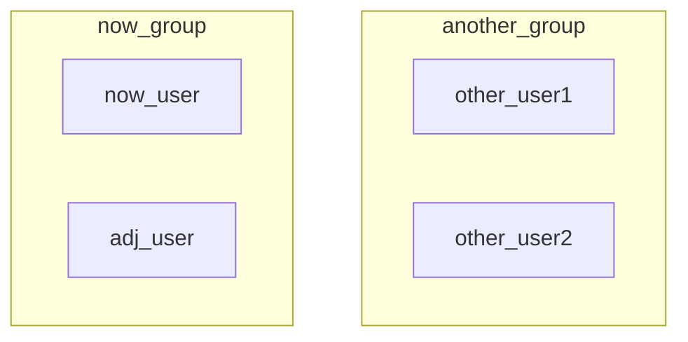

## 基本概念

在 Windows 中，我们对用户和权限的概念接触的并不多，因为很多东西都默认设置好了。但是在 GNU/Linux 中，很多文件的权限都需要自己配置和定义，因此权限管理的操作方法十分重要。

使用 `ls -l` 命令列出当前目录下所有文件的详细信息：


可以看到一共有六列信息，从左到右依次为：

- 用户访问权限；
- 与文件链接的个数；
- 文件属主；
- 文件属组；
- 文件大小；
- 最后修改日期；
- 文件/目录名。

我们重点关注第一列信息的 $10$ 个字符。

**第 $1$ 个字符**。表示当前文件的类型，共有如下几种：

|   文件类型   | 符号 |
| :----------: | :--: |
|   普通文件   | `-`  |
|     目录     | `d`  |
| 字符设备文件 | `c`  |
|  块设备文件  | `b`  |
|   符号链接   | `l`  |
| 本地域套接口 | `s`  |
|   有名管道   | `p`  |

**第 $2\sim10$ 共 $9$ 个字符**。$9$ 个字符每 $3$ 个为一组，分别表示：属主 (user) 权限、属组 (group) 权限和其他用户 (other) 权限。

user、group 和 other 的定义如下：

- 文件用户（user/u）：文件的拥有者。
- 所属组（group/g）：与该文件关联的用户组，组内成员享有特定的权限。
- 其他用户（others/o）：系统中不属于拥有者或组的其他用户。

对于当前用户 `now_user` 以及当前用户所在的组 `now_group`，同组用户 `adj_user` 和其他用户 `other_user` 可以形象的理解为以下的集合关系：



每个文件或文件夹对于不同身份的用户会有不同的权限，9 个字符就对应 3 种身份的用户访问权限。每个用户一共有 3 种权限：

| 符号 |  对于文件  |             对于目录             |
| :--: | :--------: | :------------------------------: |
| `r`  | 可查看文件 |         能列出目录下内容         |
| `w`  | 可修改文件 | 能在目录中创建、删除和重命名文件 |
| `x`  | 可执行文件 |            能进入目录            |

因此上图 `root_file.txt` 文件的 `rw-r--r--` 就表示「root 用户」对其有查看和修改的权限，「同组的其他用户」和「其他组的用户」对其只有查看权限。

那么我们平时看到的关于权限还有数字的配置，是怎么回事呢？其实是对上述字符配置的二进制数字化。读 $r$ 对应 $2^2=4$，写 $w$ 对应 $2^1=2$，可执行 $x$ 对应 $2^0=1$，例如如果一个文件对于所有用户都拥有可读、可写、可执行权限，那么就是 `rwxrwxrwx`，对应到数字就是 $777$。

## 提升权限 sudo

```bash
sudo ...
```

sudo 的全称是 superuser do，即「超级用户执行」。命令之前加上 `sudo` 的意思是普通用户以管理员身份执行指令，从而以管理员权限执行比如：安装软件、系统设置和文件系统等安全操作。可以避免不必要的安全风险。如果是 root 用户则无需添加。

## 查看当前用户 whoami

```bash
whoami
```

## 创建用户 useradd

```bash
useradd <username>
```

## 删除用户 userdel

```bash
userdel <username>
```

`-r` 表示同时删除数据信息。

## 修改用户信息 usermod

```bash
usermod
```

使用 `-h` 参数查看所有用法。

## 修改用户密码 passwd

```bash
passwd <username>
```

## 切换用户 su

```bash
su <username>
```

添加 `-` 参数则直接进入 `/home/<username>/` 目录（如果有的话）。

## 查看当前用户所属组 groups

```bash
groups
```

## 创建用户组 groupadd

```bash
groupadd
```

## 删除用户组 groupdel

```bash
groupdel
```

## 改变属主 chown

```bash
chown <user>:<group> <filename>
```

## 改变属组 chgrp

```bash
chgrp <group> <filename>
# 等价于 chown :<group> <filename>
```

## 改变权限 chmod

```bash
chmod <option> <filename>
```

将文件 filename 更改所有用户对应的权限。举个例子就知道了：让 `demo.py` 文件只能让所有者拥有可读、可写和可执行权限，其余任何用户都只有可读和可写权限。

```bash
# 写法一
chmod u=rwx,go=rw demo.py

# 写法二
chmod 766 demo.py
```

至于为什么数字表示法会用 $4,2,1$，是因为 $4,2,1$ 刚好对应了二进制的 $001, 010, 100$，三者的组合可以完美的表示出 $[0,7]$ 范围内的任何一个数。

## 默认权限 umask

```bash
umask
```

`-S` 显示字符型默认权限。

直接使用 `umask` 会显示 $4$ 位八进制数，第一位是当前用户的 $uid$，后三位分别表示当前用户创建文件时的默认权限的补，例如 $0022$ 表示当前用户 $uid$ 为 $0$，创建的文件/目录默认权限为 $777-022=755$。

可能是出于安全考虑，文件默认不允许拥有可执行权限，因此如果 `umask` 显示为 $0022$，则创建的文件默认权限为 $644$，即每一位都 $-1$ 以确保是偶数。

## 练习题

一、添加 4 个用户：alice、bob、john、mike

首先需要确保当前是 root 用户，使用 `su root` 切换到 root 用户。然后在创建用户时同时创建该用户对应的目录：

```bash
useradd -d /home/alice -m alice
useradd -d /home/bob -m bob
useradd -d /home/john -m john
useradd -d /home/mike -m mike
```


二、为 alice 设置密码

```bash
passwd alice
```


三、创建用户组 workgroup 并将 alice、bob、john 加入

- 创建用户组：

    ```bash
    groupadd workgroup
    ```

- 添加到新组：

    ```bash
    usermod -a -G workgroup alice
    usermod -a -G workgroup bob
    usermod -a -G workgroup john
    ```

    - `-a`：是 `--append` 的缩写，表示将用户添加到一个组，而不会移除她已有的其他组。这个选项必须与 `-G` 一起使用
    - `-G`：指定要添加用户的附加组（即用户可以属于多个组），这里是 workgroup

- 将 workgroup 作为各自的主组：

    ```bash
    usermod -g workgroup alice
    usermod -g workgroup bob
    usermod -g workgroup john
    ```

    - `-g`：用于指定用户的主组（primary group）。主组是当用户创建文件或目录时默认分配的组


四、创建 `/home/work` 目录并将其属主改为 alice，属组改为 workgroup

```bash
# 创建目录
mkdir work

# 修改属主和属组
chown alice:workgroup work

# 或者
chown alice.workgroup work
```


五、修改 work 目录的权限

使得属组内的用户对该目录具有所有权限，属组外的用户对该目录没有任何权限。

```bash
# 写法一
chmod ug+rwx,o-rwx work

# 写法二
chmod 770 work
```


六、权限功能测试

以 bob 用户身份在 work 目录下创建 `bob.txt` 文件。可以看到符合默认创建文件的权限格式 $644$：


同组用户与不同组用户关于「目录/文件」的 `rw` 权限测试。

- 关于 $770$ 目录。由于 work 目录被 bob 创建时权限设置为了 $770$，bob 用户与 john 用户属于同一个组 workgroup，因此 john 因为 $g=7$ 可以进入 work 目录进行操作，而 bob 用户与 mike 用户不属于同一个组，因此 mike 因为 $o=0$ 无法进入 work 目录，更不用说查看或者修改 work 目录中的文件了。
- 关于 $644$ 文件。现在 john 由于 $770$ 中的第二个 $7$ 进入了 work 目录。由文件默认的 $644$ 权限可以知道：john 因为第一个 $4$ 可以读文件，但是不可以写文件，因此如下图所示，可以执行 `cat` 查看文件内容，但是不可以执行 `echo` 编辑文件内容。至于 mike，可以看到无论起始是否在 work 目录，都没有权限 `cd` 到 work 目录或者 `ls` 查看 work 目录中的内容。


