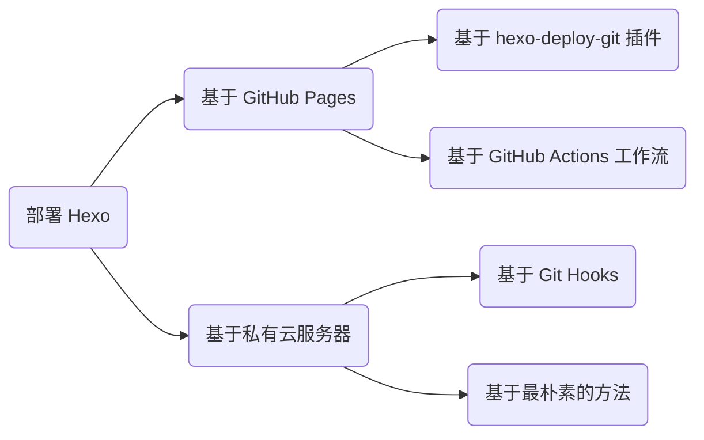

笔者比较喜欢记笔记，有时可能会分享给其他同学，直接发笔记文件不能实时更新，依托在线笔记软件也不够优雅（飞书的链接不能自定义、GitHub 的样式也比较简单），所以索性打包成网站直接部署到服务器上。现在主流建站模式有两个：

1. 有后端：[WordPress](https://cn.wordpress.org/)；
2. 无后端：[Hexo](https://hexo.io/zh-cn/)、[VuePress](https://v2.vuepress.vuejs.org/zh/)、[Gatsby](https://www.gatsbyjs.com/docs)。

有后端的网站用在知识库上显得有些大材小用，而无后端的「静态站点」很适合更新不怎么频繁的中小型知识库场景。所谓的静态站点，其实就是利用一个转换工具将自己写好的 Markdown 笔记转换为 HTML 文件，打包部署后就可以全球共享了。作者只需关注文章的内容本身，即可在极短的时间内构建一个所有人都可以访问的博客网站。

本博客以 Hexo 为例讲解如何 [从零开始搭建一个自己的博客网站](https://www.bilibili.com/video/BV1dt4y1Q7UE)。在开始之前，你需要：

- 配置好了 Node 运行时环境；
- 安装好了 Git 软件；
- 创建好了 GitHub 账号。

## 本地调试

本地调试是为了预览网站部署后的样式，这里假设你已经有了自己的 Markdown 笔记。

1）全局安装 Hexo 的命令行工具：

```bash
npm install -g hexo-cli
```

2）创建一个空文件夹后初始化项目：

```bash
mkdir web
cd web
hexo init
```

3）安装所有的库依赖：

```bash
npm install
```

4）启动本地服务（此时会在 temp 文件夹中生成网站）：

```bash
hexo server  # 可简写为 hexo s
```

Hexo 服务默认占用 4000 端口。现在用浏览器访问 `http://localhost:4000`，应当能看到 Hexo 的默认样式网站了。

## 云端部署

本地调试没问题后，就可以打包网站并部署到服务器了。所谓打包，就是将 Markdown 笔记转化为 HTML 网页；所谓部署，就是将网页放到服务器。之后用户就可以通过 IP 或域名的方式访问你的笔记了。

这里介绍以下四种方法：



### 基于 hexo-deploy-git 插件

先介绍一下 GitHub Pages。GitHub Pages 是 GitHub 官方提供的静态站点托管平台，其可以以「项目、个人和组织」三种形式进行托管，例如：

- 项目可以通过 `https://<username/orgname>.github.io/<project>/` 访问到；
- 个人可以通过 `https://<username>.github.io/` 访问到；
- 组织可以通过 `https://<orgname>.github.io/` 访问到。

Hexo 的插件生态比较全，其中的 hexo-deploy-git 可以辅助我们一键部署到 GitHub。下面以「项目部署方式」为例，将站点部署到 `https://<username>.github.io/<repo>`。

1）安装 Hexo 部署包 `hexo-deployer-git`：

```bash
npm install hexo-deployer-git --save  # --save 是为了写入库依赖表 package.json
```

2）创建一个 GitHub 仓库并将本地项目推送到 GitHub：

```bash
git add .
git commit -m 'init'
git remote add origin https://github.com/Explorer-Dong/demo.git
git push -u origin main
```

*注：如果想要以个人或组织的形式建站，就将仓库名取为 `<username/orgname>.github.io`，否则随意。

3）配置 `_config.yml` 文件（假设仓库名为 demo 并且将网站托管在推送到仓库的 `public` 分支下）：

```yaml
# 网站地址
url: https://explorer-dong.github.io/demo

# 部署策略
deploy:
  - type: git
    repo: https://github.com/Explorer-Dong/demo.git
    branch: public
```

4）部署（其实就是把生成的网页 push 到上述部署策略的仓库分支中）：

```bash
hexo deploy  # 可简写为 hexo d
```

5）配置 GitHub Pages。选择 Source 为 Deploy from a branch 并选用 `public` 分支：


现在访问 `https://<username>.github.io/demo/`，如果可以看到与之前本地调试时一样的界面，恭喜你，现在已经可以在项目的 `source/_post/` 目录下撰写文章并且全球共享了！

### 基于 GitHub Actions 工作流

该方法可以利用 GitHub Actions 的 CI/CD 功能，自动帮我们完成「本地构建并部署」这两部操作，从而让我们只需要像维护项目代码一样专注于内容创作与版本管理，而无需关心其他事情。下面以「源码和站点同属一个仓库」的场景为例讲解如何配置。

1）创建一个空 GitHub 仓库和一个鉴权 token（该鉴权 token 可以让 GitHub Actions 以你的身份操作你的仓库）：


2）赋予 GitHub Actions 读写权限：


3）本地初始化一个博客项目：

```bash
hexo init
```

4）编辑 `_config.yml` 文件中的 `url` 字段：

```yaml
url: https://explorer-dong.github.io/demo-github-actions
```

5）创建工作流文件 .`github/workflows/bot.yml` 并复制以下内容：

```yaml
name: Build and Deploy
on: [push]
jobs:
  build-and-deploy:
    runs-on: ubuntu-latest
    steps:
      # 相当于 git clone 到服务器
      - name: Checkout 🛎️
        uses: actions/checkout@v4
        with:
          persist-credentials: false

      # 安装依赖并生成页面
      - name: Install and Build 🔧
        run: |
          npm install -g hexo-cli --save
          npm install
          hexo generate

      # 部署
      - name: Deploy 🚀
        uses: JamesIves/github-pages-deploy-action@v4
        with:
          token: ${{ secrets.GITHUB_TOKEN }}
          branch: gh-pages   # 存储站点的分支
          folder: public     # 构建出来的待部署的站点文件夹名称
```

6）初始化 Git 版本管理并连接到远程仓库：

```bash
# 初始化
git init
git add .
git commit -m 'init'

# 连接远程仓库
git remote add origin https://github.com/Explorer-Dong/demo-github-actions.git

# 首次推送
git push -u origin main
```

7）在 GitHub Pages 上配置站点托管分支：


GitHub Pages 按照上述工作流的指令，检测到 push 后开始执行，即 checkout、generate 和 deploy。等待所有流程结束后，重新加载 `https://<username>.github.io/<project>/` 就可以发现站点已经托管成功了！

### 基于 Git Hooks

由于 GitHub Pages 服务使用的服务器在美国，不用魔法访问速度过慢，国内平替 Gitee Pages 已经停止服务了，综合考虑还是部署到大陆的服务器上。当然这前提是你已经拥有一台大陆「备案」的 [云服务器](https://www.aliyun.com/product/ecs?userCode=jpec1z57) 和一个 [域名](https://wanwang.aliyun.com/domain/)。如果觉得备案太麻烦，可以考虑入手一台香港服务器。下面将基于 [Git Hooks](https://githooks.com/) 工具，介绍如何将自己的 Hexo 静态网站部署到阿里云服务器上。

1）域名解析。我们需要将域名指向自己服务器的IP，下图中记录值即你的云服务器 IP 地址：


2）配置服务器。root 用户的权限过大不够安全，我们创建一个新用户并赋予一定的权限：

```bash
# 创建新用户。名称任取，假设就叫 git
useradd git

# 修改新用户密码。后续采用 SSH 免密通信，因此这个密码无所谓
passwd git

# 编辑 /etc/sudoers 文件，在 root ALL=(ALL:ALL) ALL 后追加一句
git ALL=(ALL:ALL) ALL
```

3）创建 Git Hooks。与 GitHub Pages 自动部署的工作流逻辑类似，我们将静态文件推送到云服务器后，需要让云服务器帮我们持续部署。我们可以借助 Git Hooks 的功能来实现：

```bash
# 创建一个 git 裸仓库
mkdir /home/repo/blog.git
cd /home/repo/blog.git
git init --bare

# 创建 hooks 文件用来监视仓库状态
cd hooks
touch post-receive

# 编辑 hooks 文件，在 post-receive 文件中输入以下内容
# --work-tree 表示站点路径
# --git-dir   表示仓库路径
git --work-tree=/home/web/blog --git-dir=/home/repo/blog.git checkout -f

# 为 hooks 文件授予可执行权限
chmod +x /home/repo/blog.git/hooks/post-receive

# 将仓库目录的所有权移交给 git 用户
chown -R git:git /home/repo

# 将站点目录的所有权移交给 git 用户
chown -R git:git /home/web/blog
```

4）本地部署配置。在配置好 [SSH](./operation/linux.md#ssh) 和 [Nginx](./operation/nginx.md) 后，编辑 `_config.yml` 中的 `url` 和 `deploy` 字段：

- `url` 字段修改为自己的域名：

    ```yaml
    url: https://blog.dwj601.cn
    ```

- `deploy` 字段配置如下：

    ```yaml
    deploy:
      - type: git
        repo: git@xxx.xxx.xxx.xxx:/home/repo/blog.git  # 前缀为服务器 IP
        branch: main
    ```

最后我们在本地执行 `hexo clean && hexo generate && hexo deploy` 即可实现一步部署到自己的服务器。此时检查对应目录（这里是 `home/web/blog/`）应当能看到所有的网页文件。浏览器输入对应的域名也应当可以看到具体的内容。

Git Hooks 的工作原理与 GitHub Workflow 类似，都可以在我们做出某些行为的前后自动执行一些我们预设定的任务。此处使用到的就是 [post-receive](https://git-scm.com/docs/githooks#post-receive) 任务。原文是这样解释的：

> This hook is invoked by git-receive-pack when it reacts to `git push` and updates reference(s) in its repository. It executes on the remote repository once after all the refs have been updated.

即当其接收到 push 任务并且存储库的索引被更新后，该钩子就会执行其中的内容。我们利用该功能，在将我们的站点 hexo deploy 到服务器后，hooks 检测到 git 索引更新了，就执行 checkout 命令推送上来的站点 checkout 到指定的站点托管目录下，从而实现了持续集成的功能。我画了个工作流程图，更直观的展示了 Git Hooks 在这个场景下的运行逻辑：


### 最朴素的方法

同样需要先配置好 [SSH](./operation/linux.md#ssh) 和 [Nginx](./operation/nginx.md)，接下来就两步：

1）打包网站。将 Markdown 文件转化为 HTML 文件：

```bash
hexo generate  # 可简写为 hexo g
```

此时会发现项目根目录多了一个名为 `public` 的文件夹。

2）部署网站。将上一步生成的 `public` 文件夹传输到服务器：

```bash
#!/bin/bash

# 全局变量
REMOTE_USER="git"
REMOTE_HOST="47.100.217.241"
REMOTE_DIR="/home/web"
LOCAL_SOURCE_DIR="public"
ARCHIVE_NAME="blog.tar.gz"
TARGET_DIR_NAME="blog"

# 在本地将网站压缩为一个压缩包，便于网络传输
tar -czf $ARCHIVE_NAME $LOCAL_SOURCE_DIR/

# 将压缩包上传到服务器
sftp ${REMOTE_USER}@${REMOTE_HOST} << EOF
put -r $ARCHIVE_NAME $REMOTE_DIR/
bye
EOF

# 将本地的压缩包删除（可选）
rm $ARCHIVE_NAME

# 在服务器上将压缩包解压
ssh ${REMOTE_USER}@${REMOTE_HOST} << EOF
cd $REMOTE_DIR
rm -rf $TARGET_DIR_NAME/
mkdir $TARGET_DIR_NAME/
chown -R ${REMOTE_USER}:${REMOTE_USER} $TARGET_DIR_NAME/
tar -xzf $ARCHIVE_NAME -C $TARGET_DIR_NAME/ --strip-components=1
rm $ARCHIVE_NAME
exit
EOF
```

## 功能增强

对 Hexo 生成的网站做进一步个性化的功能增强定制，部分参考 [这篇博客](https://blog.csdn.net/yaorongke/article/details/119089190)。

### 自定义域名

如果将网站托管在 GitHub Pages 上并且觉得 `xxx.github.io` 不能凸显出你的内容，GitHub Pages 提供了自定义域名的服务（将域名指向 GitHub 的服务器是不需要备案的，懂的都懂）。下面以阿里云的域名为例展开介绍。

**云平台端**。进入云平台，将自己购买的域名绑定到 GitHub Pages 对应的路由地址。

1）进入域名控制台并点击「解析」按钮：


2）填写表单，注意此处的解析请求来源一定要填默认！不要选择境外，否则无法解析成功：


由于此处我解析的是顶级域名，希望通过 `www.example.cn` 和 `example.cn` 同时访问到博客站点，因此添加了两条解析记录：


**GitHub Pages 端**。在 GitHub Pages 界面绑定刚才购买的域名。

进入仓库的 `Setting >> Pages` 页面，在 Custom domain 中填入 `<domain>.xxx` 域名并勾选强制 https 服务：


等待几分钟 DNS 解析即可使用 `<domain>.xxx` 或 `www.<domain>.xxx` 或 `<username>.github.io` 访问自己的静态网站啦！在使用了 CNAME 的情况下，如果使用 `<username>.github.io` 访问站点，一般会做重定向，即重定向为你自己的域名。

**最后的补丁**。操作完上述两步以后，GitHub 仓库会多一个 CNAME 文件。如下图所示：


这是因为自定义域名后，GitHub Pages 服务需要知道将请求转发到哪个域名上，而这需要从 CNAME 文件中获取信息。那么对应的，本地就也需要增设该文件。在项目根目录的 `source` 文件夹下添加该 CNAME 文件即可：


这样该 CNAME 文件就会被 Hexo 识别为自己的内容，从而每次都可以部署到相应的分支上了。

### 更换 mermaid 的 CDN 源

Hexo-Fuild 主题使用的 mermaid 版本较低，可能会出现本地 Markdown 编辑器渲染正常，但远程服务器渲染异常的情况。例如：


可以看到网站调用的 mermaid 脚本的版本是 8.14.0。我们在本地 Markdown 编辑器（这里以 Typora 为例）输入 `info` 后查看本地 Markdown 编辑器使用的 mermaid 版本：


显然网站用的 mermaid 版本太低了。调整方法很简单，修改一下网站调用的 mermaid 的脚本链接即可。具体地，修改 `_config_fluid.yml` 中的 mermaid 加载地址：


*注：官网给出的 [链接](https://www.jsdelivr.com/package/npm/mermaid?version=10.9.1) 无法在 Hexo-Fluid 主题中正常渲染，因为多了一个文件名 `mermaid.min.js`，而 Fluid 会在配置的 CDN 路由下遍历 `.js` 文件，因此直接删除文件名即可。

### 增强搜索功能

在网站带宽比较小的情况下（例如 3 Mbps）加载约 8.5 MB 的 `local-search.xml` 文件需要约 $\frac{8.5\times 8}{3}\approx 23$ 秒，可以考虑将该索引文件放到 [OSS](https://www.aliyun.com/product/oss?userCode=jpec1z57) 上。操作方法如下：

1）配置 `_config.fluid.yml`：

从 Fluid 的配置文件 `_config.fluid.yml` 中很容易找到 `search.path` 字段，其明确说明可以将索引文件的路径配置为外链地址，那么直接将 `hexo generate` 出来的 `local-search.xml` 文件丢到 OSS 中，然后链接到对应的「公共读」文件即可。

*注：这么做的前提是 [OSS 的流出带宽](https://help.aliyun.com/zh/oss/product-overview/limits) 要比 3 Mbps 大，事实的确如此。

2）OSS 实时更新 `local-search.xml`：

由于我会频繁更新笔记内容，就需要确保索引文件也是同步更新的。那每次都要打开阿里云 OSS 控制台然后上传 `local-search.xml` 文件吗？必然不可能。阿里云 OSS 提供了诸多的第三方工具，例如 GUI 工具：oss browser、CLI 工具：ossutil、各种语言的 SDK 等，这里用 CLI 即可。考虑到部署逻辑逐渐复杂，可以写一个 shell 脚本：

```bash
# 备份笔记到 GitHub
git push
# 部署网站
hexo clean && hexo generate && hexo deploy
# 更新 OSS 上的搜索文件
ossutil cp /path/to/local-search.xml oss://<bucket_name>/path/to/oss_folder/
```

3）解决 `OSS.Bucket` 的跨域问题：

由于 Hexo-Fuild 的搜索逻辑代码用到了 Ajax 请求，对于云服务器，其需要向 OSS 对应的主机发起请求，这就会引发浏览器的 [跨域问题](https://zh.wikipedia.org/zh-cn/跨來源資源共享) 从而导致 `local-search.xml` 文件无法正常被加载到用户的浏览器中。去阿里云 OSS 的控制台配置对应 Bucket 的 [跨域规则](https://help.aliyun.com/zh/oss/user-guide/cors-12/) 即可。例如我的配置：


现在 8.5 MB 的 `local-search.xml` 只需要几百毫秒即可加载完成，完美！
