我比较喜欢按照树的结构体系化地整理电子笔记，我一般将其称为知识库 (Wiki)，个人色彩强一点的话也可以叫做技术博客。让我产生「将知识库搭建为在线网站」这个想法主要有以下几个原因：

- 分享笔记时，如果直接发文件不能实时更新，依托在线笔记软件也不够优雅，比如飞书的链接不能自定义、GitHub 有网络限制等；
- 整理笔记时，以网站的形式呈现内容在架构上会更加清晰，更有助于我对笔记进行修改、润色和链接；
- 阅读笔记时，以网站的形式呈现内容在多端阅读时会非常方便，避免了纯 Markdown 的格式渲染问题。

所以索性直接将笔记打包成网站部署到大陆的服务器上。现在「以内容为主」的主流建站模式及其特点如下：

1. 有后端：[WordPress](https://cn.wordpress.org/) 等。用在知识库上显得有些大材小用，也不太适合多人编辑进行开源；
2. 无后端：[Hexo](https://hexo.io/zh-cn/)、[Mkdocs](https://www.mkdocs.org/)、[VuePress](https://v2.vuepress.vuejs.org/zh/)、[Gatsby](https://www.gatsbyjs.com/docs) 等。很适合更新不怎么频繁的中小型知识库场景，原理就是利用 [静态站点生成器](https://developer.mozilla.org/zh-CN/docs/Glossary/SSG) (Static Site Generator, SSG)，将写好的 Markdown 文件转换为 [HTML](../front-end/html.md)、[CSS](../front-end/css.md) 和 [JavaScript](../front-end/javascript/index.md) 文件供浏览器渲染。作者只需关注文章的内容本身，即可在极短的时间内构建一个可供外网访问的网站。

本文就以 Hexo 为例讲解如何从零开始搭建一个自己的知识库网站。掌握了该方法，其余的 SSG 逻辑都是类似的，也就一通百通了。

!!! tip
    在开始之前，你需要在本地安装好 [Node.js](https://nodejs.org/zh-cn) 和 [Git](https://git-scm.com/)，并创建一个 [GitHub](https://github.com) 账号。

## 本地调试

本地调试是为了预览网站部署后的样式，这里假设你已经有了自己的 Markdown 笔记。

1）全局安装 Hexo 的命令行工具：

```bash
npm install -g hexo-cli
```

2）创建一个空文件夹后初始化项目：

```bash
mkdir web
cd web
hexo init
```

3）安装所有的库依赖：

```bash
npm install
```

4）启动本地服务（此时会在 temp 文件夹中生成网站）：

```bash
hexo server  # 可简写为 hexo s
```

Hexo 服务默认占用 4000 端口。现在用浏览器访问 `http://localhost:4000`，应当能看到 Hexo 的默认样式网站了。

## 云端部署

本地调试没问题后，就可以打包网站并部署到服务器了。所谓打包，就是将 Markdown 笔记转化为 HTML 网页；所谓部署，就是将网页放到服务器。之后用户就可以通过 IP 或域名的方式访问你的笔记了。

这里介绍以下四种方法（选择其中的任意一种方法部署你的网站即可）：

```mermaid
graph LR
  A(部署 Hexo)
  S1(基于 GitHub Pages)
  S2(基于私有云服务器)
  m1(基于 hexo-deploy-git 插件)
  m2(基于 GitHub Actions 工作流)
  m3(基于 Git Hooks)
  m4(基于最朴素的方法)
  A --> S1
  A --> S2
  S1 --> m1
  S1 --> m2
  S2 --> m3
  S2 --> m4
```



### 基于 hexo-deploy-git 插件

先介绍一下 GitHub Pages。GitHub Pages 是 GitHub 官方提供的静态站点托管平台，其可以以「项目、个人和组织」三种形式进行托管，例如：

- 项目可以通过 `https://<username/orgname>.github.io/<project>/` 访问到；
- 个人可以通过 `https://<username>.github.io/` 访问到；
- 组织可以通过 `https://<orgname>.github.io/` 访问到。

Hexo 的插件生态比较全，其中的 hexo-deploy-git 可以辅助我们一键部署到 GitHub。下面以「项目部署方式」为例，将站点部署到 `https://<username>.github.io/<repo>`。

1）安装 Hexo 部署包 `hexo-deployer-git`：

```bash
npm install hexo-deployer-git --save  # --save 是为了写入库依赖表 package.json
```

2）创建一个 GitHub 仓库并将本地项目推送到 GitHub：

```bash
git add .
git commit -m 'init'
git remote add origin https://github.com/Explorer-Dong/demo.git
git push -u origin main
```

*注：如果想要以个人或组织的形式建站，就将仓库名取为 `<username/orgname>.github.io`，否则随意。

3）配置 `_config.yml` 文件（假设仓库名为 demo 并且将网站托管在推送到仓库的 `public` 分支下）：

```yaml
# 网站地址
url: https://explorer-dong.github.io/demo

# 部署策略
deploy:
  - type: git
    repo: https://github.com/Explorer-Dong/demo.git
    branch: public
```

4）部署（其实就是把生成的网页 push 到上述部署策略的仓库分支中）：

```bash
hexo deploy  # 可简写为 hexo d
```

5）配置 GitHub Pages。选择 Source 为 Deploy from a branch 并选用 `public` 分支：


现在访问 `https://<username>.github.io/demo/`，如果可以看到与之前本地调试时一样的界面，恭喜你，现在已经可以在项目的 `source/_post/` 目录下撰写文章并且全球共享了！

### 基于 GitHub Actions 工作流

该方法可以利用 GitHub Actions 的 CI/CD 功能，自动帮我们完成「本地构建并部署」这两部操作，从而让我们只需要像维护项目代码一样专注于内容创作与版本管理，而无需关心其他事情。下面以「源码和站点同属一个仓库」的场景为例讲解如何配置。

1）创建一个空 GitHub 仓库和一个鉴权 token（该鉴权 token 可以让 GitHub Actions 以你的身份操作你的仓库）：


2）赋予 GitHub Actions 读写权限：


3）本地初始化一个博客项目：

```bash
hexo init
```

4）编辑 `_config.yml` 文件中的 `url` 字段：

```yaml
url: https://explorer-dong.github.io/demo-github-actions
```

5）创建工作流文件 .`github/workflows/bot.yml` 并复制以下内容：

```yaml
name: Build and Deploy
on: [push]
jobs:
  build-and-deploy:
    runs-on: ubuntu-latest
    steps:
      # 相当于 git clone 到服务器
      - name: Checkout 🛎️
        uses: actions/checkout@v4
        with:
          persist-credentials: false

      # 安装依赖并生成页面
      - name: Install and Build 🔧
        run: |
          npm install -g hexo-cli --save
          npm install
          hexo generate

      # 部署
      - name: Deploy 🚀
        uses: JamesIves/github-pages-deploy-action@v4
        with:
          token: ${{ secrets.GITHUB_TOKEN }}
          branch: gh-pages   # 存储站点的分支
          folder: public     # 构建出来的待部署的站点文件夹名称
```

6）初始化 Git 版本管理并连接到远程仓库：

```bash
# 初始化
git init
git add .
git commit -m 'init'

# 连接远程仓库
git remote add origin https://github.com/<user_name>/<repo_name>.git

# 首次推送
git push -u origin main
```

7）在 GitHub Pages 上配置站点托管分支：


GitHub Pages 按照上述工作流的指令，检测到 push 后开始执行，即 checkout、generate 和 deploy。等待所有流程结束后，重新加载 `https://<username>.github.io/<project>/` 就可以发现站点已经托管成功了！

### 基于 Git Hooks

由于 GitHub Pages 服务使用的服务器在美国，不用魔法访问速度过慢，国内平替 Gitee Pages 已经停止服务了，综合考虑还是部署到大陆的服务器上。当然这前提是你已经拥有一台大陆「备案」的 [云服务器](https://www.aliyun.com/product/ecs?userCode=jpec1z57) 和一个 [域名](https://wanwang.aliyun.com/domain/)。如果觉得备案太麻烦，可以考虑入手一台香港服务器。

假设你已经有了一台云服务器。为了简化后续文件上传操作，需要建立本地机和云服务器的 [SSH](./ssh.md) 连接。下面将基于 [Git Hooks](https://githooks.com/) 工具，介绍如何将自己的 Hexo 静态网站部署到阿里云服务器上。

1）域名解析。我们需要将域名指向自己服务器的 IP，下图中记录值即你的云服务器 IP 地址：


2）配置服务器。root 用户的权限过大不够安全，我们创建一个新用户并赋予一定的权限：

```bash
# 创建新用户。名称任取，假设就叫 git
useradd git

# 修改新用户密码。后续采用 SSH 免密通信，因此这个密码无所谓
passwd git

# 编辑 /etc/sudoers 文件，在 root ALL=(ALL:ALL) ALL 后追加一句
git ALL=(ALL:ALL) ALL
```

然后安装并配置 [Nginx](../operation/nginx.md)，确保外网也可以访问服务器。

3）创建 Git Hooks。与 GitHub Pages 自动部署的工作流逻辑类似，我们将静态文件推送到云服务器后，需要让云服务器帮我们持续部署。我们可以借助 Git Hooks 的功能来实现：

```bash
# 创建一个 git 裸仓库
mkdir /home/repo/blog.git
cd /home/repo/blog.git
git init --bare

# 创建 hooks 文件用来监视仓库状态
cd hooks
touch post-receive

# 编辑 hooks 文件，在 post-receive 文件中输入以下内容
# --work-tree 表示站点路径
# --git-dir   表示仓库路径
git --work-tree=/home/web/blog --git-dir=/home/repo/blog.git checkout -f

# 为 hooks 文件授予可执行权限
chmod +x /home/repo/blog.git/hooks/post-receive

# 将仓库目录的所有权移交给 git 用户
chown -R git:git /home/repo

# 将站点目录的所有权移交给 git 用户
chown -R git:git /home/web/blog
```

4）本地部署配置。编辑 `_config.yml` 中的 `url` 和 `deploy` 字段：

- `url` 字段修改为自己的域名：

    ```yaml
    url: https://blog.dwj601.cn
    ```

- `deploy` 字段配置如下：

    ```yaml
    deploy:
      - type: git
        repo: git@xxx.xxx.xxx.xxx:/home/repo/blog.git  # 前缀为服务器 IP
        branch: main
    ```

最后我们在本地执行 `hexo clean && hexo generate && hexo deploy` 即可实现一步部署到自己的服务器。此时检查服务器对应目录（这里是 `home/web/blog/`）应当能看到所有的网页文件。浏览器输入对应的域名也应当可以看到具体的内容。

Git Hooks 的工作原理与 GitHub Workflow 类似，都可以在我们做出某些行为的前后自动执行一些我们预设定的任务。此处使用到的就是 [post-receive](https://git-scm.com/docs/githooks#post-receive) 任务。原文是这样解释的：

> This hook is invoked by git-receive-pack when it reacts to `git push` and updates reference(s) in its repository. It executes on the remote repository once after all the refs have been updated.

即当其接收到 push 任务并且存储库的索引被更新后，该钩子就会执行其中的内容。我们利用该功能，在将我们的站点 `hexo deploy` 到服务器后，hooks 检测到 Git 索引更新了，就执行 checkout 命令推送上来的站点 checkout 到指定的站点托管目录下，从而实现了持续集成的功能。我画了个工作流程图，更直观的展示了 Git Hooks 在这个场景下的运行逻辑：


### 基于最朴素的方法

同样需要先配置好 [SSH](./ssh.md) 和 [Nginx](../operation/nginx.md)。接下来就两步：

1）打包网站。将 Markdown 文件转化为 HTML 文件：

```bash
hexo generate  # 可简写为 hexo g
```

此时会发现项目根目录多了一个名为 `public` 的文件夹。

2）部署网站。将上一步生成的 `public` 文件夹传输到服务器：

```bash
#!/bin/bash

# 全局变量
REMOTE_USER="git"
REMOTE_HOST="47.100.217.241"
REMOTE_DIR="/home/web"
LOCAL_SOURCE_DIR="public"
ARCHIVE_NAME="blog.tar.gz"
TARGET_DIR_NAME="blog"

# 在本地将网站压缩为一个压缩包，便于网络传输
tar -czf $ARCHIVE_NAME $LOCAL_SOURCE_DIR/

# 将压缩包上传到服务器
sftp ${REMOTE_USER}@${REMOTE_HOST} << EOF
put -r $ARCHIVE_NAME $REMOTE_DIR/
bye
EOF

# 将本地的压缩包删除（可选）
rm $ARCHIVE_NAME

# 在服务器上将压缩包解压
ssh ${REMOTE_USER}@${REMOTE_HOST} << EOF
cd $REMOTE_DIR
rm -rf $TARGET_DIR_NAME/
mkdir $TARGET_DIR_NAME/
chown -R ${REMOTE_USER}:${REMOTE_USER} $TARGET_DIR_NAME/
tar -xzf $ARCHIVE_NAME -C $TARGET_DIR_NAME/ --strip-components=1
rm $ARCHIVE_NAME
exit
EOF
```

## 功能增强

对 Hexo 生成的网站做进一步个性化的功能增强定制，部分参考 [这篇博客](https://blog.csdn.net/yaorongke/article/details/119089190)。

### 自定义域名

如果将网站托管在 GitHub Pages 上并且觉得 `xxx.github.io` 不能凸显出你的内容，GitHub Pages 提供了自定义域名的服务（将域名指向 GitHub 的服务器是不需要备案的，懂的都懂）。下面以阿里云的域名为例展开介绍。

1）进入云平台，将自己购买的域名绑定到 GitHub Pages 对应的路由地址：


2）填写表单，注意此处的解析请求来源一定要填默认！不要选择境外，否则无法解析成功：


由于此处我解析的是顶级域名，希望通过 `www.example.cn` 和 `example.cn` 同时访问到博客站点，因此添加了两条解析记录：


3）在 GitHub Pages 界面绑定刚才购买的域名。

进入仓库的 `Setting >> Pages` 页面，在 Custom domain 中填入 `<domain>.xxx` 域名并勾选强制 https 服务：


等待几分钟 DNS 解析即可使用 `<domain>.xxx` 或 `www.<domain>.xxx` 或 `<username>.github.io` 访问自己的静态网站啦！在使用了 CNAME 的情况下，如果使用 `<username>.github.io` 访问站点，一般会做重定向，即重定向为你自己的域名。

4）最后的补丁。操作完上述两步以后，GitHub 仓库会多一个 CNAME 文件。如下图所示：


这是因为自定义域名后，GitHub Pages 服务需要知道将请求转发到哪个域名上，而这需要从 CNAME 文件中获取信息。那么对应的，本地就也需要增设该文件。在项目根目录的 `source` 文件夹下添加该 CNAME 文件即可：


这样该 CNAME 文件就会被 Hexo 识别为自己的内容，从而每次都可以部署到相应的分支上了。

### 更换 mermaid 的 CDN 源

Hexo-Fuild 主题使用的 mermaid 版本较低，可能会出现本地 Markdown 编辑器渲染正常，但远程服务器渲染异常的情况。例如：


可以看到网站调用的 mermaid 脚本的版本是 8.14.0。我们在本地 Markdown 编辑器（这里以 Typora 为例）输入 `info` 后查看本地 Markdown 编辑器使用的 mermaid 版本：


显然网站用的 mermaid 版本太低了。调整方法很简单，修改一下网站调用的 mermaid 的脚本链接即可。具体地，修改 `_config_fluid.yml` 中的 mermaid 加载地址：


*注：官网给出的 [链接](https://www.jsdelivr.com/package/npm/mermaid?version=10.9.1) 无法在 Hexo-Fluid 主题中正常渲染，因为多了一个文件名 `mermaid.min.js`，而 Fluid 会在配置的 CDN 路由下遍历 `.js` 文件，因此直接删除文件名即可。

### 增强搜索功能

在网站带宽比较小的情况下（例如 3 Mbps）加载约 8.5 MB 的 `local-search.xml` 文件需要约 $\frac{8.5\times 8}{3}\approx 23$ 秒，可以考虑将该索引文件放到 [OSS](https://www.aliyun.com/product/oss?userCode=jpec1z57) 上。操作方法如下：

1）配置 `_config.fluid.yml`：

从 Fluid 的配置文件 `_config.fluid.yml` 中很容易找到 `search.path` 字段，其明确说明可以将索引文件的路径配置为外链地址，那么直接将 `hexo generate` 出来的 `local-search.xml` 文件丢到 OSS 中，然后链接到对应的「公共读」文件即可。

*注：这么做的前提是 [OSS 的流出带宽](https://help.aliyun.com/zh/oss/product-overview/limits) 要比 3 Mbps 大，事实的确如此。

2）OSS 实时更新 `local-search.xml`：

由于我会频繁更新笔记内容，就需要确保索引文件也是同步更新的。那每次都要打开阿里云 OSS 控制台然后上传 `local-search.xml` 文件吗？必然不可能。阿里云 OSS 提供了诸多的第三方工具，例如 GUI 工具：oss browser、CLI 工具：ossutil、各种语言的 SDK 等，这里用 CLI 即可。考虑到部署逻辑逐渐复杂，可以写一个 shell 脚本：

```bash
# 备份笔记到 GitHub
git push
# 部署网站
hexo clean && hexo generate && hexo deploy
# 更新 OSS 上的搜索文件
ossutil cp /path/to/local-search.xml oss://<bucket_name>/path/to/oss_folder/
```

3）解决 `OSS.Bucket` 的跨域问题：

由于 Hexo-Fuild 的搜索逻辑代码用到了 Ajax 请求，对于云服务器，其需要向 OSS 对应的主机发起请求，这就会引发浏览器的 [跨域问题](https://zh.wikipedia.org/zh-cn/跨來源資源共享) 从而导致 `local-search.xml` 文件无法正常被加载到用户的浏览器中。去阿里云 OSS 的控制台配置对应 Bucket 的 [跨域规则](https://help.aliyun.com/zh/oss/user-guide/cors-12/) 即可。例如我的配置：


现在 8.5 MB 的 `local-search.xml` 只需要几百毫秒即可加载完成，完美！
