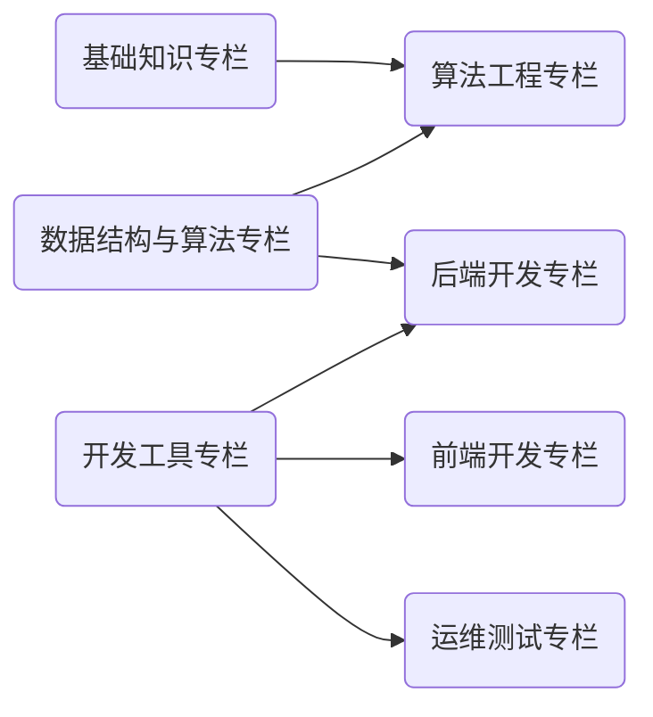

本网站以 **体系化** 的学习笔记为基础，旨在围绕「计算机与人工智能」构建一个 **开放知识社群**。您的⭐与反馈是我们更新的最大动力！

下图展示了本站的所有专栏（可点击跳转）：

```mermaid
graph LR
    %% 实体定义
    aics_base(基础知识专栏)
    ds_and_algo(数据结构与算法专栏)
    algo_engineering(算法工程专栏)
    dev_tools(开发工具专栏)
    front_end(前端开发专栏)
    back_end(后端开发专栏)
    dev_ops(运维测试专栏)

    %% 关系定义
    aics_base --> algo_engineering
    ds_and_algo --> algo_engineering & back_end
    dev_tools --> front_end & back_end & dev_ops
  
    %% 跳转链接
    click aics_base "./base/"
    click ds_and_algo "./ds-and-algo/"
    click algo_engineering "./algo-engineering/"
    click dev_tools "./dev-tools/"
    click front_end "./front-end/"
    click back_end "./back-end/"
    click dev_ops "./operation/"
```

