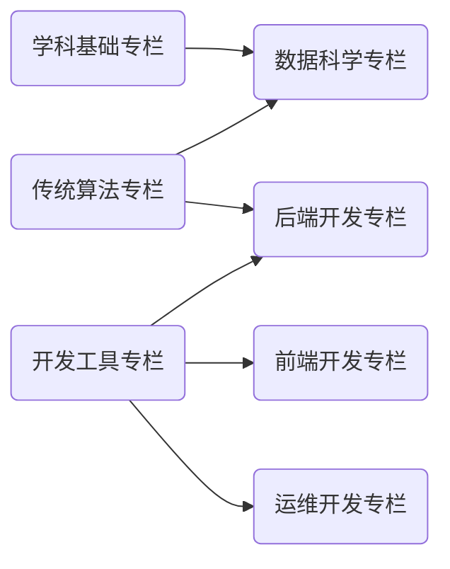

## 本站定位

本网站以体系化的 AI/CS 学习笔记为基础，旨在构建一个 **开放知识社群**。笔记按照 Markdown 格式记录，站点采用 MkDocs 框架编译，云端基于 Aliyun OSS 服务部署。如果您觉得内容不错，欢迎⭐！

*[Wiki]: 一种允许一群用户用简单的描述来创建和连接一组网页的社会计算系统。

## 共建社区

若您有 **意见或建议**，欢迎参与贡献！贡献者名单将会出现在对应页面的底部，也会给您的 GitHub 账户累计贡献积分。详细的贡献方式：

1. 点击网站右上角的小猫娘前往 GitHub 仓库；
2. 点击右上角 Fork 按钮；
3. 回到原来的网站页面点击右上角铅笔按钮；
4. 编辑内容后向我发起 Pull Request。

当然您也可以将仓库克隆至本地，按照 `.github/workflows/bot.yml` 文件指引安装构建文档所需的依赖环境，完成修改/新增后，推送至仓库并向我发起 Pull Request。

## 行文规范

本站点行文格式主要参考 OI Wiki 格式手册 [^oi-format]。其中：

- 标题：单页文章标题为 H2 至 H3，低于 H3 等级的标题不应再出现，可以采用段首加粗的形式；
- 链接：所有内链采用 `标题/章节` 的链接格式，所有外链采用 `标题/章节 | 作者/组织 - (顶级域名)` 的链接/引用格式。

[^oi-format]: [格式手册 | OI Wiki - (oi-wiki.org)](https://oi-wiki.org/intro/format/)

## 站点地图

<caption> 站点内容拓扑图 </caption>

