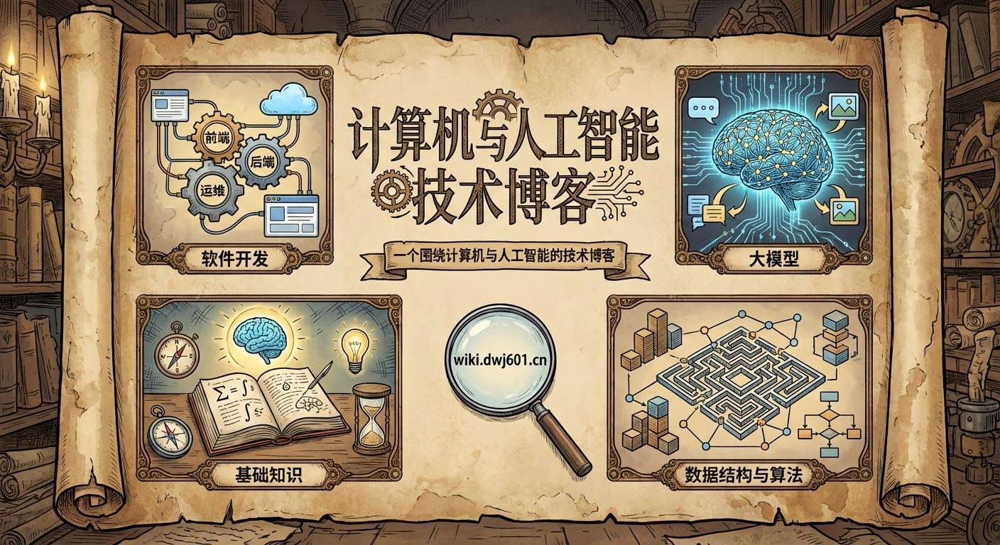

本网站托管笔者的技术博客，围绕「计算机」与「人工智能」两大主题，展开以下四个板块：

-   :octicons-book-16:{ .lg .middle } **基础知识**

    ---

    数学、人工智能、计算机等基础知识。

    [:octicons-arrow-right-24: 开始阅读](./base/index.md)

-   :material-graph-outline:{ .lg .middle } **数据结构与算法**

    ---

    数据结构、动态规划、图论等经典算法。

    [:octicons-arrow-right-24: 开始阅读](./ds-and-algo/index.md)

-   :fontawesome-regular-file-code:{ .lg .middle } **软件开发**

    ---

    前端、后端、运维等开发方法。

    [:octicons-arrow-right-24: 开始阅读](./develop/index.md)

-   :material-robot-outline:{ .lg .middle } **大模型**

    ---

    基础设施、模型架构、下游应用等研究内容。

    [:octicons-arrow-right-24: 开始阅读](./llm/index.md)

碍于笔者认知，博客内容难免有些偏差。如果您在阅读的过程中遇到了困惑，请不要吝啬您的意见或建议。详细的贡献方法请移步 [参与贡献](./contributing.md) 作进一步了解。下图是本项目的协作者名单：

如果觉得网站内容对您有帮助，欢迎进入 [GitHub](https://github.com/Explorer-Dong/wiki) 为我们的项目点一颗 Star。您的⭐与反馈是我们更新的最大动力！下图是本项目的星标历史：

