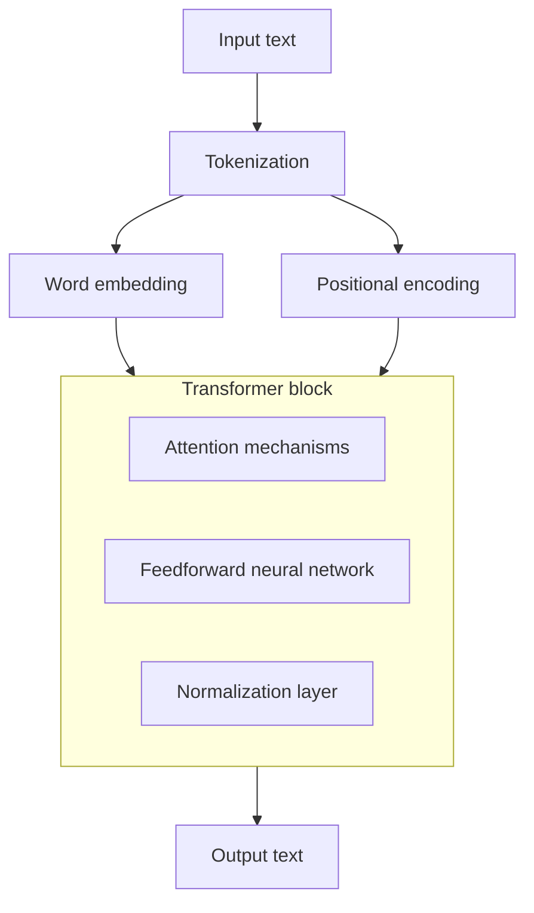

!!! tip
    推荐一个很直观的 Transformer 可视化交互网站：[Transformer Explainer](https://poloclub.github.io/transformer-explainer/)。

本文介绍 Transformer 模型的基本原理。

## 产生背景

在 [使用 RNN 进行文本生成任务](../../../base/ai/natural-language-processing/text-generation.md) 时，RNN 由于只能按时间步串行计算，导致：

- 信息量上：所有信息被压缩进单一隐状态，在长距离信息传递时导致信息量急速衰减；
- 扩展性上：无法充分利用 GPU 的并行特性，训练缓慢，难以扩展到大型模型。

[*Attention Is All You Need*](https://arxiv.org/abs/1706.03762) 应运而生。其提出的 Transformer 网络架构让序列中任意两个 token 可以直接交互，不再依赖顺序递推结构，做到了并行计算，从而可以狠狠地堆网络深度，从根本上提升了建模效率与表达能力。

## 模型结构

Transformer 由 Encoder-Decoder 结构组成，每个部分包含多个堆叠的 Block。每个 Block 内部均采用一致的模式：注意力机制、前馈网络、残差连接、层归一化。整体架构如下图所示：

可以抽象为下图：

### 数据流向

训练阶段，输入序列与目标序列（右移一位）同时输入模型。Encoder 负责构建输入序列的上下文表示，Decoder 通过 Masked Self-Attention 仅观察到历史 token，从而计算条件概率 $p(y\mid x)$，最终组合损失 $\,\text{loss}=-\log p(y\mid x)\,$。

推理阶段，Decoder 只能看到已生成的 token，每生成一个新的 token 即重新参与一次前向运算。因果 Mask 保证生成过程满足自回归约束。

### Positional Embedding

Transformer 无递归结构，无法内建位置信息，必须显式提供。

论文提出正弦位置编码：

$$
\begin{aligned}
\text{PE}_{(pos,2i)}=\sin\left(\frac{pos}{10000^{2i/d}}\right) \\
\text{PE}_{(pos,2i+1)}=\cos\left(\frac{pos}{10000^{2i/d}}\right)
\end{aligned}
$$

特性包括：

- 可外推（序列变长仍能使用）  
- 可微、周期性强  
- 不增加额外参数  

工程中也可以选择训练型位置向量，将其直接加入 token embedding。

### Multi-Head Attention

多头注意力通过为每个 token 生成 $Q,K,V$，再按头划分多个独立子空间捕获不同关系模式。整体公式为：

$$
\text{MHA}(X)=\text{Concat}(h_1,\ldots, h_H)W_O
$$

每个头独立计算注意力，从而提升多尺度、多关系的表达能力。

注意力的核心计算方式是缩放点积 (Scaled Dot-Product Attention)：

$$
\text{Attention}(Q, K, V)=\text{softmax}\left(\frac{QK^\top}{\sqrt{d_k}}\right)V
$$

缩放因子 $\sqrt{d_k}$ 用于抑制高维向量点积的数值爆炸，使 softmax 保持稳定。

Encoder 的 Self-Attention 不需要 Mask，所有 token 可以进行全局交互，从而捕获输入序列中的长依赖。该模块在每个 Encoder Block 都会重复出现，使表示不断强化。

### Masked Multi-Head Attention

Decoder 必须保证只使用已生成的历史 token，因此注意力矩阵中未来位置会被替换为 $-\infty$，经 softmax 后权重为 $0$，从而实现因果性。

Masked Multi-Head Attention 的计算与普通 Attention 相同，但输入矩阵中会添加因果 Mask：

- 上三角区域被抑制  
- 保证自回归生成流程合法  

### Cross Attention

Decoder 获取输入序列信息的关键模块。其输入 $Q$ 来自 Decoder，$K,V$ 来自 Encoder。作用如下：

- 建立输出与输入的跨序列对齐  
- 捕获翻译等任务中的对应关系  
- 是连接 Encoder 表示与 Decoder 生成的唯一桥梁  

### Feed-Forward Network

每个 Block 中都有一个位置独立的前馈网络，用于局部非线性变换，从而确保网络的表示能力。常见形式是两层线性层加激活函数：

$$
\text{FFN}(x)=W_2\,\sigma(W_1\,x+b_1)+b_2
$$

通常 $W_1$ 会将维度扩展为原来的 $4$ 倍，再缩回原维度，以增强表示能力。

### Residual & LayerNorm

每个子层（注意力层、FFN）外部都包裹残差连接和层归一化：

- 残差连接让梯度传播路径更短，更稳定  
- LayerNorm 保持数值稳定，使训练更快收敛  

典型结构：

- **Pre-LN**：先归一化，再进入子层（现代模型更常用）  
- **Post-LN**：子层后归一化（原论文形式）  

### Dropout

注意力权重、FFN 输出、残差路径都会用到 dropout，减少过拟合，有助于稳定训练。

## 性能分析

假设某个句子 S 的 token 数为 $n$，模型嵌入维度为 $d$（由于 $n$ 往往远大于 $d$，所以我们认为 $n$ 为变量，$d$ 为常量）。

计算 $Q,K,V$ 矩阵：

- $n$ 个 token 的嵌入表示为 $X_{n\times d}$，$W_Q,W_K,W_V$ 的维度均为 $d\times d$，那么 $Q_{n\times d}=XW_Q$ 就需要 $nd^2$ 次运算，时间复杂度为 $O(n)$；
- $K$ 和 $V$ 的运算同理。

计算注意力分数：

- 对于 $\frac{QK^\top}{\sqrt{d_k}}$，需要进行 $n^2d$ 次运算，时间复杂度为 $O(n^2)$；
- softmax 需要对 $n\times n$ 的矩阵做归一化，时间复杂度为 $O(n^2)$；
- 将归一化后的结果和 $V$ 矩阵相乘，即 $n\times n$ 与 $n\times d$ 叉积得到 S 的 $n\times d$ 的注意力分数矩阵，时间复杂度为 $O(n^2)$；
- 将注意力分数过一个 $d\to d$ 的线性层得到最终 $n\times d$ 的输出，时间复杂度为 $O(n)$。

在不考虑多头机制（即会将 $d$ 维划分为 $h$ 个 $d_h$）的情况下，总时间复杂度为 $O(n^2)$。

## 代码实现

参考：

- [Transformer Model Tutorial in PyTorch: From Theory to Code](https://www.datacamp.com/tutorial/building-a-transformer-with-py-torch)
- [hyunwoongko/transformer](https://github.com/hyunwoongko/transformer)
