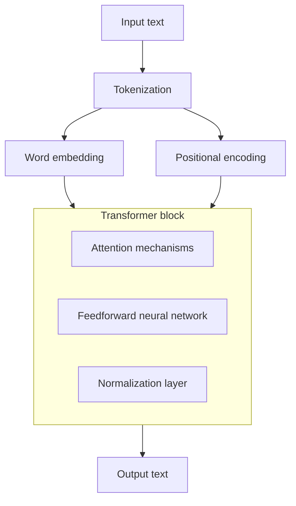

[CS 336: Language Modeling from Scratch](https://stanford-cs336.github.io/spring2025/)

设计更通用、更稳健、更高效的大模型。

*注：每篇文章建议包含：动机 → 方法 → 关键公式/伪码 → 实验设置 → 结论与边界 → 复现要点与常见坑。

## A. 基础与现代化细节

1. **Transformer 再认识**：多头注意力、残差与归一化的作用；位置编码从绝对到相对（RoPE/ALiBi）。
    - 结论点：现代位置编码（如 RoPE）有利于长上下文外推与旋转等变性质；注意力实现的 IO/算术强度成为瓶颈。
    - 参考：Vaswani et al., 2017；Su et al., 2023（RoPE）；Press et al., 2021（ALiBi）。
2. **Attention 加速栈**：FlashAttention/Flash-Decoding 的核心思想（重排计算顺序、减少 HBM 访存）。
    - 参考：Dao et al., 2022/2023。

## B. 规模化法则与数据策划

1. **Scaling Laws**：参数量、数据量与计算预算的最优配比；Chinchilla 观测与 token 预算。
    - 结论点：在固定训练计算量下，**更多数据、相对更小模型** 往往更优（Chinchilla 结果）。
    - 参考：Kaplan et al., 2020；Hoffmann et al., 2022（Chinchilla）。
2. **数据工程**：去重与质量过滤；指令/偏好数据配比；合成数据与风险。
    - 参考：Brown et al., 2020；Touvron et al., 2023（LLaMA）。

## C. 结构与能力扩展

1. **MoE（专家混合）**：密集 vs 稀疏计算、路由器设计、负载均衡与稳定训练。
    - 参考：Fedus et al., 2021（Switch Transformer）；Lepikhin et al., 2020（GShard）。
2. **长上下文与外部记忆**：位置缩放、注意力稀疏、滑动窗口、缓存复用；检索记忆耦合。
    - 参考：Xiong et al., 2023（Position Interpolation）；Beltagy et al., 2020（Longformer）。
3. **指令与偏好对齐**：SFT、RLHF、DPO/ORPO/GRPO；奖励建模与稳定性。
    - 参考：Ouyang et al., 2022（RLHF）；Rafailov et al., 2023（DPO）。

## D. 训练技巧与稳健性

1. **优化与数值稳定**：AdamW/BF16/FP8；梯度裁剪、损失标度、Kaiming vs Xavier；Checkpointing。
2. **正则化与鲁棒性**：Dropout、混合损失、拒答与安全对齐的权衡。

## E. 评测与可解释

1. **通用评测**：Perplexity 与任务相关性的关系；MMLU/BBH/AGIEval 的优缺点与失效场景。
2. **可解释与诊断**：Logit Lens、特征探测器、干预与因果评测（概览）。

## 预训练

trasnformer-based 架构：

[LLM Architecture: A Comprehensive Guide](https://sam-solutions.com/blog/llm-architecture/)

2025-07：[The Big LLM Architecture Comparison](https://magazine.sebastianraschka.com/p/the-big-llm-architecture-comparison)

大模型基本架构：

动态词向量：

- TagLM
- ELMo：Peters et al. Deep contextualized word representations. NAACL. 2018. [arxiv](https://arxiv.org/abs/1802.05365)

编码器架构：

- BERT：BERT: Pre-training of Deep Bidirectional Transformers for Language Understanding. 2019. [arxiv](https://arxiv.org/abs/1810.04805)

- RoBERTa：Yinhan Liu et al. Roberta: A robustly optimized BERT pretraining approach, 2019. [arxiv](https://arxiv.org/abs/1907.11692)

    参数量和 BERT 齐平。基于 BERT 进行了如下修改：

    - 更大的 batch size ，训练数据更多，训练时间更长；

    - 动态掩码机制 (未用于中文版本)。将数据输入时才 masking，并将训练数据复制多份，一条数据可以进行不同的 masking，划分进不同的 epoch，充分利用数据；

    - 删除下一句预测(NSP)任务，认为太简单，对模型序列无益；

    - 文本编码采用一种在 word-level 和 character-level 之间的表示

- ALBERT：Lan et al. ALBERT: A Lite BERT for Self-supervised Learning of Language Representations, 2019. [arxiv](https://arxiv.org/abs/1909.11942)

    ALBERT = A Lite BERT，轻量版 BERT，2019 年提出。有以下特点：

    - 对词嵌入参数进行因式分解，降低词嵌入的维度；

    - 跨层参数共享，直接减少参数量；

    - 句子顺序预测 (Sentence-order prediction, SOP) 取代 NSP，增加任务难度。

- ELECTRA：Clark et al. ELECTRA: Pre-training Text Encoders as Discriminators Rather Than Generators. 2019. [arxiv](https://arxiv.org/abs/2003.10555)

    Objective: replaced token detection (RTD)：判断 token 是替换过的还是原来的。模型会从所有输入标记中学习，而不仅仅是 mask 部分，使计算更有效率。生成器和判别器共同训练，但判别器的梯度不会回流到生成器。

编码器 + 解码器架构：

- BART：Lewis et al. BART: Denoising sequence-to-sequence pretraining for natural language generation, translation, and comprehension. 2020. [arxiv](https://arxiv.org/abs/1910.13461)

    Bidirectional and Auto-Regressive Transformers，由 Meta 于 2019.10 提出：

    - 具备完整的编码器和解码器，比 BERT 更适合做生成任务；

    - 比纯 decoder 多了双向上下文语境信息。

- T5：Raffel et al. Exploring the limits of transfer learning with a unified text-to-text transformer. 2020. [arxiv](https://arxiv.org/abs/1910.10683)

    Text-to-Text Transfer Transformer，由 Google 于 2019.10 提出：

    - Encoder-Decoder 结构；

    - 预训练任务是掩码语言模型：可能 mask 多个连续 token，输出被 mask 的序列，而非完整序列。

解码器架构：

- GPT

## 后训练

后训练是基于预训练好的模型，调整其参数使得可以「更适用于特定任务、更符合人类价值观」。针对这两个任务目标，分别产生了以 SFT 和 RLHF 为代表的后训练策略：

- SFT：即 Supervised Fine-Tuning，指监督微调。
- RLHF：即 Reinforcement Learning from Human Feedback，指基于人类反馈的强化学习。

本系列文章将分别针对这两个后训练策略，详细讲解其工作流程。
