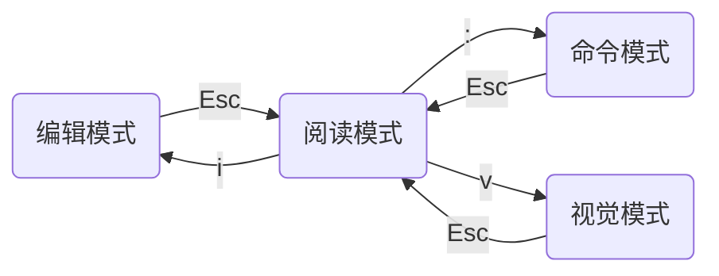

[Vim](https://vimcdoc.sourceforge.net/) 是一款编辑器，旨在让程序员脱离鼠标，沉浸式编码。本文就来简单介绍一下 Vim。

## 软件配置

### 安装 vim

有些系统自带的 Vim 可能会缺少一些功能，或者干脆就没有 Vim，直接安装即可：

```bash
# Ubuntu/Debian
apt install vim-gtk3
```

### 查看 vim 信息

```bash
vim --version
```

使用上述命令可以看到 vim 的所有信息，包括软件编译信息、功能支持列表、配置文件路径等等。

### 常见 vim 配置

使用 `vim --version` 找到配置文件路径，然后编辑配置文件：

```bash
# 显示行号
set number

# 显示相对行号
set relativanumber

# 高亮搜索结果
set hlsearch
```

## 基本命令

Vim 有多种模式来应多不同的场景。使用 `vim <file>` 打开或创建文件后会进入阅读模式，之后模式之间的转换如下图所示：



不同的模式有不同的适用场景以及对应的命令，下面开始介绍。

### 阅读模式

进入阅读模式：

- `Esc`：所有模式进入阅读模式的方法。

光标移动：

- `h` `j` `k` `l`：光标移动选项，分别表示 $\leftarrow\ \downarrow\ \uparrow\ \rightarrow$。
- `5j`：往上跳转到第 5 行（开启相对行号）。
- `6k`：往下跳转到第 6 行（开启相对行号）。
- `gg`：移动到首行（游戏结束 good game）。
- `G` 或 `Shift + g`：移动到尾行。
- `w`：跳到下一个单词首部 (word)。
- `e`：跳到下一个单词尾部 (end)。
- `b`：跳到上一个单词首部 (back)。

编辑内容：

- `yy`：复制整行 (yank)。
- `yw`：复制单词 (yank word)。
- `dd`：删除整行 (delete)。
- `dw`：删除单词并保持阅读模式 (delete word)。
- `cw`：删除单词并进入编辑模式 (change word)。
- `p`：粘贴 (paste)。
- `2p`：连续复制 2 次。
- `.`：重复上次命令。
- `u`：撤销上次命令 (undo)。
- `Ctrl + r`：取消撤销上次命令。
- `Shift + <`：左缩进（可在视觉模式中选中多行进行）。
- `Shift + >`：右缩进（可在视觉模式中选中多行进行）。

### 编辑模式

进入编辑模式：

- `i`：从光标左侧插入 (insert)。
- `I` 或 `Shift + i`：从光标所在行首插入。
- `a`：从光标左侧插入右侧插入 (append)。
- `A` 或 `Shift + a`：从光标所在行尾插入。
- `o`：在光标下方新增一行 (open a new line)。
- `O` 或 `Shift + o`：在光标上方新增一行。

### 命令模式

进入命令模式：

- `:`：进入命令模式。

保存文件逻辑：

- `:q`：直接退出。

- `:q!`：不保存退出。

- `:wq`：保存并退出。

搜索文本逻辑：

- `/`：进入搜索的命令模式，从光标位置从上往下搜索。输入待搜索的内容后回车进入阅读模式。

- `?`：进入搜索的命令模式，从光标位置从下往上搜索。输入待搜索的内容后回车进入阅读模式。

- `n`：搜索的下一个匹配项 (next)。

- `Shift + n`：搜索的上一个匹配项。

### 视觉模式

进入视觉模式：

- `v`：进入视觉模式

文本编辑逻辑（移动光标后选中对应的文本）：

- `x`：剪切选中目标。
- `y`：复制选中目标。
